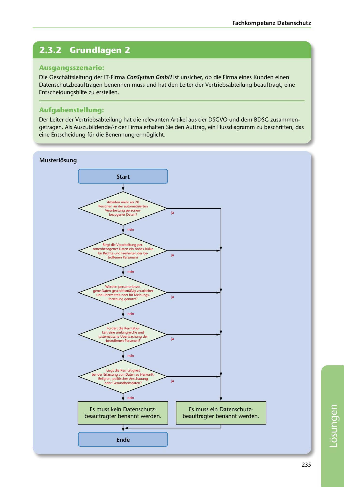

---
## Page 237
---

### Fachkompetenz Datenschutz

<!-- IMAGE: page-237-img-1.jpeg - TODO: Add description -->

**[VISUAL: DATA PROTECTION OFFICER DECISION FLOWCHART - SOLUTION]**
A completed flowchart for determining whether an organization must appoint a Data Protection Officer (Datenschutzbeauftragter). The decision tree includes multiple yes/no decision points based on DSGVO and BDSG criteria, leading to either "Es muss ein Datenschutzbeauftragter benannt werden" (DPO required) or "Es muss kein Datenschutzbeauftragter benannt werden" (DPO not required).

## Ausgangsszenario:

Die Geschaftsleitung der IT-Firma ConSystem GmbH ist unsicher, ob die Firma eines Kunden einen Datenschutzbeauftragen benennen muss und hat den Leiter der Vertriebsabteilung beauftragt, eine Entscheidungshilfe zu erstellen.

## Aufgabenstellung:

Der Leiter der Vertriebsabteilung hat die relevanten Artikel aus der DSGVO und dem BDSG zusammen- getragen. Als Auszubildende/-r der Firma erhalten Sie den Auftrag, ein Flussdiagramm zu beschriften, das eine Entscheidung für die Benennung ermoglicht.

**[VISUAL: DATA PROTECTION OFFICER DECISION FLOWCHART - SOLUTION]**
A completed flowchart for determining whether an organization must appoint a Data Protection Officer (Datenschutzbeauftragter). The decision tree includes multiple yes/no decision points based on DSGVO and BDSG criteria, leading to either "Es muss ein Datenschutzbeauftragter benannt werden" (DPO required) or "Es muss kein Datenschutzbeauftragter benannt werden" (DPO not required).

### Musterlosung

### Start

ja

ja

ja

ja

ja

**[VISUAL: DATA PROTECTION OFFICER DECISION FLOWCHART - SOLUTION]**
A completed flowchart for determining whether an organization must appoint a Data Protection Officer (Datenschutzbeauftragter). The decision tree includes multiple yes/no decision points based on DSGVO and BDSG criteria, leading to either "Es muss ein Datenschutzbeauftragter benannt werden" (DPO required) or "Es muss kein Datenschutzbeauftragter benannt werden" (DPO not required).

Es muss kein Datenschutz- beauftragter benannt werden.

Es muss ein Datenschutz- beauftragter benannt werden.

### Ende

235

**[VISUAL: DATA PROTECTION OFFICER DECISION FLOWCHART - SOLUTION]**
A completed flowchart for determining whether an organization must appoint a Data Protection Officer (Datenschutzbeauftragter). The decision tree includes multiple yes/no decision points based on DSGVO and BDSG criteria, leading to either "Es muss ein Datenschutzbeauftragter benannt werden" (DPO required) or "Es muss kein Datenschutzbeauftragter benannt werden" (DPO not required).
