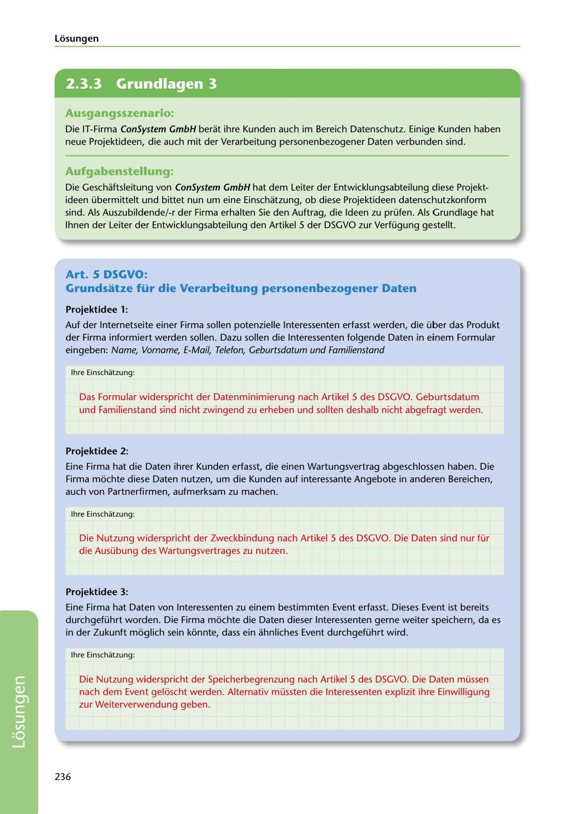

---
## Page 238
---

Losungen

<!-- IMAGE: page-238-img-1.jpeg - TODO: Add description -->

**[VISUAL: CONSYSTEM GMBH SOLUTION HEADER]**
Header image for the ConSystem GmbH DSGVO compliance assessment solutions section.

### Ausgangsszenario:

Die IT-Firma ConSystem GmbH berat ihre Kunden auch im Bereich Datenschutz. Einige Kunden haben neue Projektideen, die auch mit der Verarbeitung personenbezogener Daten verbunden sind.

### Aufgabenstellung:

Die Geschaftsleitung von ConSystem GmbH hat dem Leiter der Entwicklungsabteilung diese Projekt- ideen übermittelt und bittet nun um eine Einschatzung, ob diese Projektideen datenschutzkonform sind. Als Auszubildende/-r der Firma erhalten Sie den Auftrag, die Ideen zu prüfen. Als Grundlage hat lhnen der Leiter der Entwicklungsabteilung den Artikel 5 der DSGVO zur Verfügung gestellt.

## Art. 5 DSGVO:

## Grundsatze für die Verarbeitung personenbezogener Daten

### Projektidee 1:

Auf der lnternetseite einer Firma sollen potenzielle lnteressenten erfasst werden, die über das Produkt der Firma informiert werden sollen. Dazu sollen die lnteressenten folgende Daten in einem Formular eingeben: Name, Vorname, E-Mail, Telefon, Geburtsdatum und Familienstand

lhre Einschatzung:

Das Formular widerspricht der Datenminimierung nach Artikel 5 des DSGVO. Geburtsdatum und Familienstand sind nicht zwingend zu erheben und sollten deshalb nicht abgefragt werden.

### Projektidee 2:

Eine Firma hat die Daten ihrer Kunden erfasst, die einen Wartungsvertrag abgeschlossen haben. Die Firma móchte diese Daten nutzen, um die Kunden auf interessante Angebote in anderen Bereichen, auch von Partnerfirmen, aufmerksam zu machen.

lhre Einschatzung:

Die Nutzung widerspricht der Zweckbindung nach Artikel 5 des DSGVO. Die Daten sind nur für die Ausübung des Wartungsvertrages zu nutzen.

### Projektidee 3:

Eine Firma hat Daten von lnteressenten zu einem bestimmten Event erfasst. Dieses Event ist bereits durchgeführt worden. Die Firma móchte die Daten dieser lnteressenten gerne weiter speichern, da es in der Zukunft móglich sein kónnte, dass ein ahnliches Event durchgeführt wird.

lhre Einschatzung:

Die Nutzung widerspricht der Speicherbegrenzung nach Artikel 5 des DSGVO. Die Daten müssen nach dem Event gelóscht werden. Alternativ müssten die lnteressenten explizit ihre Einwilligung zur Weiterverwendung geben.

236

**[VISUAL: CONSYSTEM GMBH SOLUTION HEADER]**
Header image for the ConSystem GmbH DSGVO compliance assessment solutions section.
