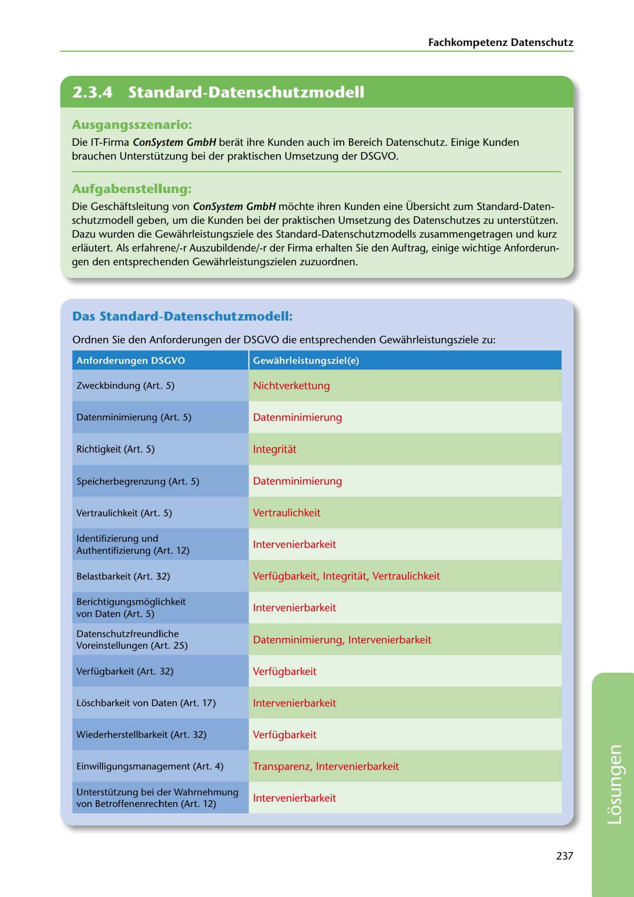

---
## Page 239
---

Fachkompetenz Datenschutz

<!-- IMAGE: page-239-img-1.jpeg - TODO: Add description -->

**[VISUAL: CONSYSTEM GMBH SOLUTION HEADER]**
Header image for the ConSystem GmbH Standard Data Protection Model (SDM) solutions section.

## Ausgangsszenario:

Die IT-Firma ConSystem GmbH berat ihre Kunden auch im Bereich Datenschutz. Einige Kunden brauchen Unterstützung bei der praktischen Umsetzung der DSGVO.

## Aufgabenstellung:

Die Geschaftsleitung von ConSystem GmbH mochte ihren Kunden eine Übersicht zum Standard-Daten- schutzmodell geben, um die Kunden bei der praktischen Umsetzung des Datenschutzes zu unterstützen. Dazu wurden die Gewahrleistungsziele des Standard-Datenschutzmodells zusammengetragen und kurz erlautert. Als erfahrene/-r Auszubildende/-r der Firma erhalten Sie den Auftrag, einige wichtige Anforderun- gen den entsprechenden Gewahrleistungszielen zuzuordnen.

## Das Standard-Datenschutzmodell:

Ordnen Sie den Anforderungen der DSGVO die entsprechenden Gewahrleistungsziele zu:

### Anforderungen DSGVO

### Gewahrleistungsziel(e)

Zweckbindung (Art. 5)

Nichtverkettung

### Datenminimierung (Art. 5)

Datenminimierung

Richtigkeit (Art. 5)

lntegritat

Datenminimierung

Speicherbegrenzung (Art. 5)

Vertraulichkeit (Art. 5)

Vertraulichkeit

lntervenierbarkeit

### ldentifizierung und

### Authentifizierung (Art. 12)

### Belastbarkeit (Art. 32)

Verfügbarkeit, lntegritat, Vertraulichkeit

lntervenierbarkeit

### Berichtigungsmoglichkeit

### von Daten (Art. 5)

Datenminimierung, lntervenierbarkeit

### Voreinstellungen (Art. 25)

Datenschutzfreundliche

### Verfügbarkeit (Art. 32)

Verfügbarkeit

Loschbarkeit von Daten (Art. 17)

lntervenierbarkeit

### Wiederherstellbarkeit (Art. 32)

Verfügbarkeit

### Einwilligungsmanagement (Art. 4)

Transparenz, lntervenierbarkeit

lntervenierbarkeit

### Unterstützung bei der Wahrnehmung

### von Betroffenenrechten (Art. 12)

237

**[VISUAL: CONSYSTEM GMBH SOLUTION HEADER]**
Header image for the ConSystem GmbH Standard Data Protection Model (SDM) solutions section.
