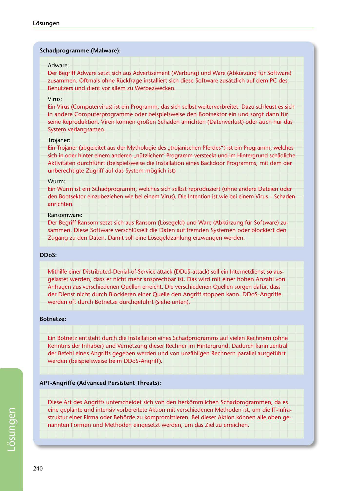

---
## Page 242
---

### Losungen

### Schadprogramme (Malware):

Adware:

Der Begriff Adware setzt sich aus Advertisement (Werbung) und Ware (Abkürzung für Software) zusammen. Oftmals ohne Rückfrage installiert sich diese Software zusatzlich auf dem PC des Benutzers und dient vor allem zu Werbezwecken.

Virus:

Ein Virus (Computervirus) ist ein Programm, das sich selbst weiterverbreitet. Dazu schleust es sich in andere Computerprogramme oder beispielsweise den Bootsektor ein und sorgt dann für seine Reproduktion. Viren kéinnen gro~en Schaden anrichten (Datenverlust) oder auch nur das System verlangsamen.

Trojaner:

Ein Trojaner (abgeleitet aus der Mythologie des ,,trojanischen Pferdes") ist ein Programm, welches sich in oder hinter einem anderen ,,nützlichen" Programm versteckt und im Hintergrund schadliche Aktivitaten durchführt (beispielsweise die lnstallation eines Backdoor Programms, mit dem der unberechtigte Zugriff auf das System moglich ist)

Wurm:

Ein Wurm ist ein Schadprogramm, welches sich selbst reproduziert (ohne andere Dateien oder den Bootsektor einzubeziehen wie bei einem Virus). Die lntention ist wie bei einem Virus - Schaden anrichten.

Ransomware: Der Begriff Ransom setzt sich aus Ransom (Léisegeld) und Ware (Abkürzung für Software) zu- sammen. Diese Software verschlüsselt die Daten auf fremden Systemen oder blockiert den Zugang zu den Daten. Damit soll eine Léisegeldzahlung erzwungen werden.

### DDoS:

Mithilfe einer Distributed-Denial-of-Service attack (DDoS-attack) soll ein lnternetdienst so aus- gelastet werden, dass er nicht mehr ansprechbar ist. Das wird mit einer hohen Anzahl von Anfragen aus verschiedenen Quellen erreicht. Die verschiedenen Quellen sorgen dafür, dass der Dienst nicht durch Blockieren einer Quelle den Angriff stoppen kann. DDoS-Angriffe werden oft durch Botnetze durchgeführt (siehe unten).

### Botnetze:

Ein Botnetz entsteht durch die lnstallation eines Schadprogramms auf vielen Rechnern (ohne Kenntnis der lnhaber) und Vernetzung dieser Rechner im Hintergrund. Dadurch kann zentral der Befehl eines Angriffs gegeben werden und von unzahligen Rechnern parallel ausgeführt werden (beispielsweise beim DDoS-Angriff).

### APT-Angriffe (Advanced Persistent Threats):

Diese Art des Angriffs unterscheidet sich von den herkommlichen Schadprogrammen, da es eine geplante und intensiv vorbereitete Aktion mit verschiedenen Methoden ist, um die IT-lnfra- struktur einer Firma oder Behéirde zu kompromittieren. Bei dieser Aktion kéinnen alle oben ge- nannten Formen und Methoden eingesetzt werden, um das Ziel zu erreichen.

240

<!-- IMAGE: page-242-img-1.jpeg - TODO: Add description -->
