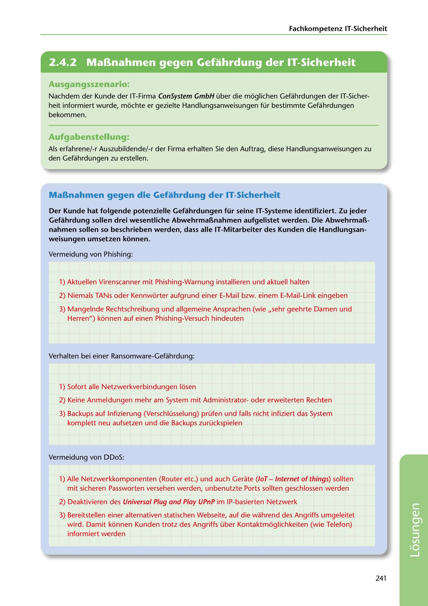

---
## Page 243
---

Fachkompetenz IT-Sicherheit

<!-- IMAGE: page-243-img-1.jpeg - TODO: Add description -->

**[VISUAL: CONSYSTEM GMBH SOLUTION HEADER]**
Header image for the ConSystem GmbH IT security countermeasures solutions section.

### Ausgangsszenario:

Nachdem der Kunde der IT-Firma ConSystem GmbH über die moglichen Gefahrdungen der IT-Sicher- heit informiert wurde, mochte er gezielte Handlungsanweisungen für bestimmte Gefahrdungen bekommen.

### Aufgabenstellung:

Als erfahrene/-r Auszubildende/-r der Firma erhalten Sie den Auftrag, diese Handlungsanweisungen zu den Gefahrdungen zu erstellen.

## MaBnahmen gegen die Gefahrdung der IT-Sicherheit

### weisungen umsetzen konnen.

Der Kunde hat folgende potenzielle Gefahrdungen für seine IT-Systeme identifiziert. Zu jeder Gefahrdung sollen drei wesentliche AbwehrmaBnahmen aufgelistet werden. Die AbwehrmaB- nahmen sollen so beschrieben werden, dass alle IT-Mitarbeiter des Kunden die Handlungsan-

Vermeidung von Phishing:

1) Aktuellen Virenscanner mit Phishing-Warnung installieren und aktuell halten

2) Niemals TANs oder Kennworter aufgrund einer E-Mail bzw. einem E-Mail-Link eingeben

3) Mangelnde Rechtschreibung und allgemeine Ansprachen (wie ,,sehr geehrte Damen und Herren") konnen auf einen Phishing-Versuch hindeuten

Verhalten bei einer Ransomware-Gefahrdung:

1) Sofort alle Netzwerkverbindungen losen

2) Keine Anmeldungen mehr am System mit Administratoroder erweiterten Rechten

3) Backups auf lnfizierung (Verschlüsselung) prüfen und falls nicht infiziert das System komplett neu aufsetzen und die Backups zurückspielen

Vermeidung von DDoS:

1) Alle Netzwerkkomponenten (Router etc.) und auch Gerate (/oT - Internet of things) sollten mit sicheren Passworten versehen werden, unbenutzte Ports sollten geschlossen werden

2) Deaktivieren des Universal Plug and Play UPnP im IP-basierten Netzwerk

3) Bereitstellen einer alternativen statischen Webseite, auf die wahrend des Angriffs umgeleitet

wird. Damit konnen Kunden trotz des Angriffs über Kontaktmoglichkeiten (wie Telefon) informiert werden

241

**[VISUAL: CONSYSTEM GMBH SOLUTION HEADER]**
Header image for the ConSystem GmbH IT security countermeasures solutions section.
