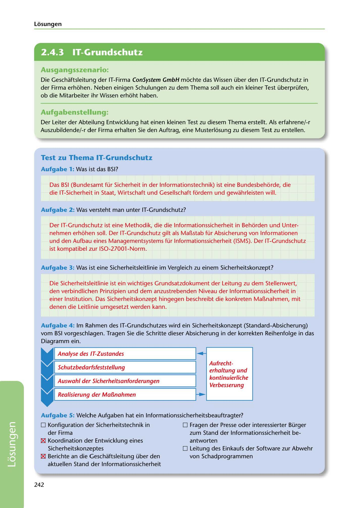

---
## Page 244
---

Losungen

<!-- IMAGE: page-244-img-1.jpeg - TODO: Add description -->

### Ausgangsszenario:

Die Geschaftsleitung der IT-Firma ConSystem GmbH mochte das Wissen über den IT-Grundschutz in der Firma erhohen. Neben einigen Schulungen zu dem Thema soll auch ein kleiner Test überprüfen, ob die Mitarbeiter ihr Wissen erhoht haben.

### Aufgabenstellung:

Der Leiter der Abteilung Entwicklung hat einen kleinen Test zu diesem Thema erstellt. Als erfahrene/-r Auszubildende/-r der Firma erhalten Sie den Auftrag, eine Musterlosung zu diesem Test zu erstellen.

## Test zu Thema IT-Grundschutz

### Aufgabe 1: Was ist das BSI?

Das BSI (Bundesamt für Sicherheit in der lnformationstechnik) ist eine Bundesbehorde, die die IT-Sicherheit in Staat, Wirtschaft und Gesellschaft fürdern und gewahrleisten will.

### Aufgabe 2: Was versteht man unter IT-Grundschutz?

Der IT-Grundschutz ist eine Methodik, die die lnformationssicherheit in Behorden und Unter- nehmen erhohen soll. Der IT-Grundschutz gilt als Ma~stab für Absicherung von lnformationen und den Aufbau eines Managementsystems für lnformationssicherheit (ISMS). Der IT-Grundschutz ist kompatibel zur ISO-27001-Norm.

Aufgabe 3: Was ist eine Sicherheitsleitlinie im Vergleich zu einem Sicherheitskonzept?

Die Sicherheitslleitlinie ist ein wichtiges Grundsatzdokument der Leitung zu dem Stellenwert, den verbindlichen Prinzipien und dem anzustrebenden Niveau der lnformationssicherheit in einer lnstitution. Das Sicherheitskonzept hingegen beschreibt die konkreten Ma~nahmen, mit denen die Leitlinie umgesetzt werden kann.

# 1~

1

# ~ I

# 11

Aufgabe 4 : lm Rahmen des IT-Grundschutzes wird ein Sicherheitskonzept (Standard-Absicherung) vom BSI vorgeschlagen. Tragen Sie die Schritte dieser Absicherung in der korrekten Reihenfolge in das Diagramm ein. Analyse des JT-Zustandes Schutzbedarfsfeststellung

• Auswahl der Sicherheitsanforderungen

### Verbesserung

Aufrecht- erhaltung und kontinuierliche

, , Realisierung der MaBnahmen

# ~ ..___.

Aufgabe 5: Welche Aufgaben hat ein lnformationssicherheitsbeauftragter?

O Konfiguration der Sicherheitstechnik in

O Fragen der Presse oder interessierter Bürger

der Firma

181 Koordination der Entwicklung eines

Sicherheitskonzeptes

zum Stand der lnformationssicherheit be- antworten O Leitung des Einkaufs der Software zur Abwehr

von Schadprogrammen

181 Berichte an die Geschaftsleitung über den

aktuellen Stand der lnformationssicherheit

242

**[VISUAL: IT SECURITY CONCEPT PROCESS DIAGRAM - SOLUTION]**
A completed cyclic diagram showing the BSI IT-Grundschutz security concept implementation steps: Schutzbedarfsfeststellung (protection requirements analysis) → Analyse des IT-Zustandes (IT status analysis) → Auswahl der Sicherheitsanforderungen (security requirements selection) → Realisierung der Maßnahmen (implementation of measures) → Aufrechterhaltung und kontinuierliche Verbesserung (maintenance and continuous improvement), with arrows showing the iterative cycle.
