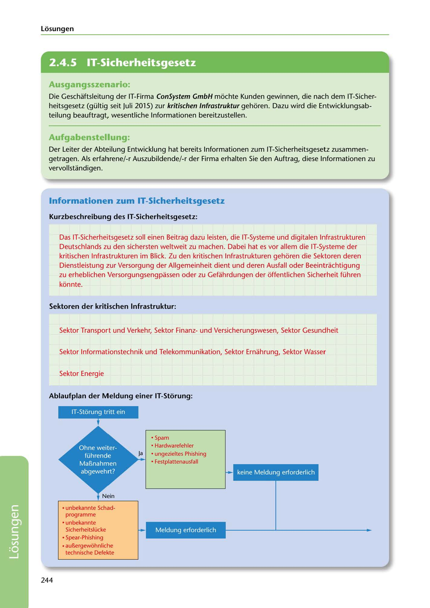

---
## Page 246
---

Losungen

<!-- IMAGE: page-246-img-1.jpeg - TODO: Add description -->

## Ausgangsszenario:

Die Geschaftsleitung der IT-Firma ConSystem GmbH mochte Kunden gewinnen, die nach dem IT-Sicher- heitsgesetz (gültig seit Juli 2015) zur kritischen lnfrastruktur gehoren. Dazu wird die Entwicklungsab- teilung beauftragt, wesentliche lnformationen bereitzustellen.

## Aufgabenstellung:

Der Leiter der Abteilung Entwicklung hat bereits lnformationen zum IT-Sicherheitsgesetz zusammen- getragen. Als erfahrene/-r Auszubildende/-r der Firma erhalten Sie den Auftrag, diese lnformationen zu vervollstandigen.

## lnformationen zum IT-Sicherheitsgesetz

### Kurzbeschreibung des IT-Sicherheitsgesetz:

Das IT-Sicherheitsgesetz soll einen Beitrag dazu leisten, die IT-Systeme und digitalen lnfrastrukturen Deutschlands zu den sichersten weltweit zu machen. Dabei hat es vor allem die IT-Systeme der kritischen lnfras.trukturen im Blick. Zu den kritischen lnfrastrukturen gehoren die Sektoren deren Dienstleistung zur Versorgung der Allgemeinheit dient und deren Ausfall oder Beeintrachtigung zu erheblichen Versorgungsengpassen oder zu Gefahrdungen der offentlichen Sicherheit führen

konnte.

### Sektoren der kritischen lnfrastruktur:

Sektor Transport und Verkehr, Sektor Finanzund Versicherungswesen, Sektor Gesundheit

Sektor lnformationstechnik und Telekommunikation, Sektor Ernahrung, Sektor Wasser

Sektor Energie

### Ablaufplan der Meldung einer IT-Storung:

IT-Storung tritt ein

• Spam • Hardwarefehler • ungezieltes Phishing • Festplattenausfall

keine Meldung erforderlich

**[VISUAL: IT SECURITY INCIDENT REPORTING FLOWCHART - SOLUTION]**
A completed flowchart showing the IT Security Act (IT-Sicherheitsgesetz) incident reporting process for critical infrastructure. Left branch shows incidents requiring no report (spam, hardware errors, untargeted phishing, hard drive failures). Right branch shows incidents requiring mandatory reporting (unknown malware, unknown security vulnerabilities, spear-phishing, extraordinary technical defects).

• unbekannte Schad-

programme

**[VISUAL: IT SECURITY INCIDENT REPORTING FLOWCHART - SOLUTION]**
A completed flowchart showing the IT Security Act (IT-Sicherheitsgesetz) incident reporting process for critical infrastructure. Left branch shows incidents requiring no report (spam, hardware errors, untargeted phishing, hard drive failures). Right branch shows incidents requiring mandatory reporting (unknown malware, unknown security vulnerabilities, spear-phishing, extraordinary technical defects).

Meldung erforderlich

• unbekannte Sicherheitslücke • Spear-Phishing • aul!ergewiihnliche

technische Defekte

244

**[VISUAL: IT SECURITY INCIDENT REPORTING FLOWCHART - SOLUTION]**
A completed flowchart showing the IT Security Act (IT-Sicherheitsgesetz) incident reporting process for critical infrastructure. Left branch shows incidents requiring no report (spam, hardware errors, untargeted phishing, hard drive failures). Right branch shows incidents requiring mandatory reporting (unknown malware, unknown security vulnerabilities, spear-phishing, extraordinary technical defects).
