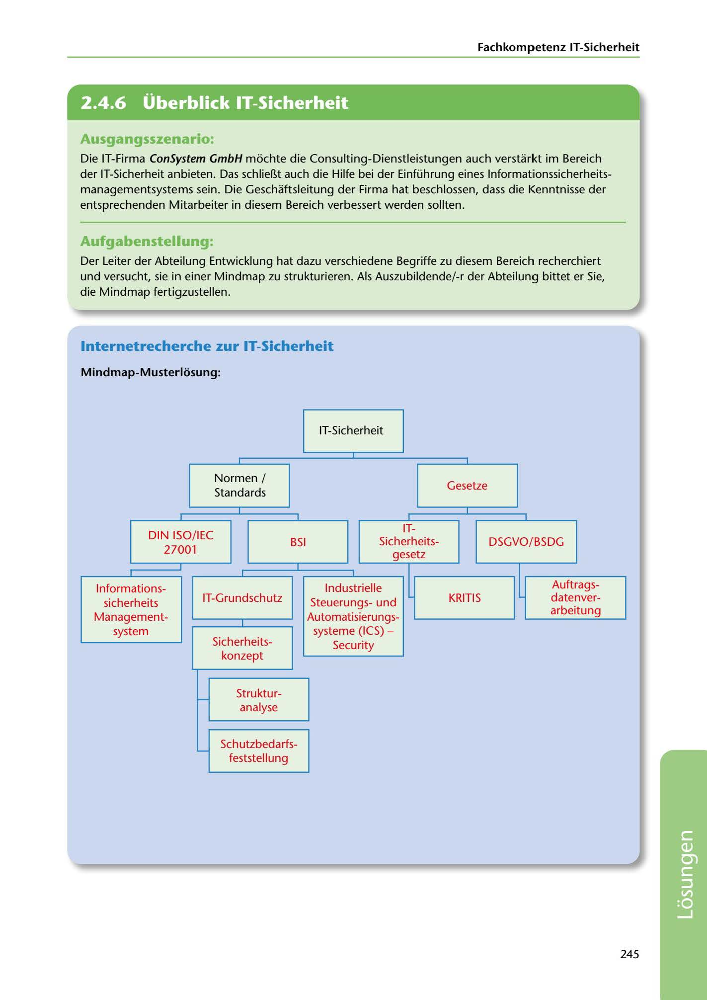

---
## Page 247
---

Fachkompetenz IT-Sicherheit

<!-- IMAGE: page-247-img-1.jpeg - TODO: Add description -->

**[VISUAL: IT SECURITY MINDMAP - SOLUTION]**
A completed mindmap showing IT security concepts with branches for: Gesetze (laws - DSGVO/BDSG, IT-Sicherheitsgesetz, KRITIS), Normen/Standards (DIN ISO/IEC 27001, BSI, IT-Grundschutz), and related concepts including Informationssicherheits-Managementsystem (ISMS), Sicherheitskonzept, Strukturanalyse, and Schutzbedarfsfeststellung.

## Ausgangsszenario:

Die IT-Firma ConSystem GmbH mochte die Consulting-Dienstleistungen auch verstarkt im Bereich der IT-Sicherheit anbieten. Das schlieí).t auch die Hilfe bei der Einführung eines lnformationssicherheits- managementsystems sein. Die Geschaftsleitung der Firma hat beschlossen, dass die Kenntnisse der entsprechenden Mitarbeiter in diesem Bereich verbessert werden sollten.

## Aufgabenstellung:

Der Leiter der Abteilung Entwicklung hat dazu verschiedene Begriffe zu diesem Bereich recherchiert und versucht, sie in einer Mindmap zu strukturieren. Als Auszubildende/-r der Abteilung bittet er Sie, die Mindmap fertigzustellen.

## lnternetrecherche zur IT-Sicherheit

### M indmap-Musterlosung:

IT-Sicherheit

Gesetze

Normen / Standards

IT- Sicherheits-

DSGVO/ BSDG

DIN ISO/IEC BSI 27001

gesetz

1

Auftr ags-

1 nformations-

nver-

IT-Grundschutz

KRITIS

# l

tung date arbei

# l

lndustrielle Steuerungsund Automatisierungs-

1

systeme (ICS) -

sicherheits Management- system

Secunty

Sicherheits- konzept

Struktur- analyse

Schutzbedarfs-

feststel I ung

245

**[VISUAL: IT SECURITY MINDMAP - SOLUTION]**
A completed mindmap showing IT security concepts with branches for: Gesetze (laws - DSGVO/BDSG, IT-Sicherheitsgesetz, KRITIS), Normen/Standards (DIN ISO/IEC 27001, BSI, IT-Grundschutz), and related concepts including Informationssicherheits-Managementsystem (ISMS), Sicherheitskonzept, Strukturanalyse, and Schutzbedarfsfeststellung.
