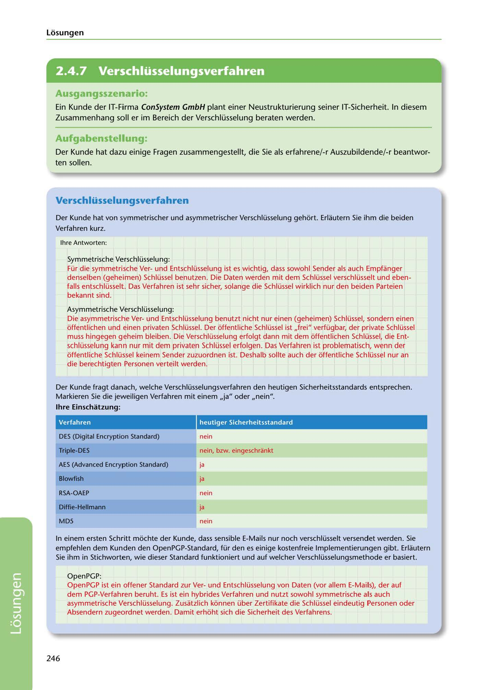

---
## Page 248
---

Losungen

<!-- IMAGE: page-248-img-1.jpeg - TODO: Add description -->

## Ausgangsszenario:

Ein Kunde der IT-Firma ConSystem GmbH plant einer Neustrukturierung seiner IT-Sicherheit. In diesem Zusammenhang soll er im Bereich der Verschlüsselung beraten werden.

## Aufgabenstellung.

Der Kunde hat dazu einige Fragen zusammengestellt, die Sie als erfahrene/-r Auszubildende/-r beantwor- ten sallen.

## Verschlüsselungsverfahren

Der Kunde hat von symmetrischer und asymmetrischer Verschlüsselung gehort. Erlautern Sie ihm die beiden Verfahren kurz.

lhre Antworten:

Symmetrische Verschlüsselung: Für die symmetrische Verund Entschlüsselung ist es wichtig, dass sowohl Sender als auch Empfanger denselben (geheimen) Schlüssel benutzen. Die Daten werden mit dem Schlüssel verschlüsselt und eben- falls entschlüsselt. Das Verfahren ist sehr sicher, solange die Schlüssel wirklich nur den beiden Parteien bekannt sind.

Asymmetrische Verschlüsselung:

Die asymmetrische Verund Entschlüsselung benutzt nicht nur einen (geheimen) Schlüssel, sondern einen offentlichen und einen privaten Schlüssel. Der offentliche Schlüssel ist ,,frei" verfügbar, der private Schlüssel muss hingegen geheim bleiben. Die Verschlüsselung erfolgt dann mit dem offentlichen Schlüssel, die Ent- schlüsselung kann nur mit dem privaten Schlüssel erfolgen. Das Verfahren ist problematisch, wenn der offentliche Schlüssel keinem Sender zuzuordnen ist. Deshalb sollte auch der offentliche Schlüssel nur an die berechtigten Personen verteilt werden.

Der Kunde fragt danach, welche Verschlüsselungsverfahren den heutigen Sicherheitsstandards entsprechen. Markieren Sie die jeweiligen Verfahren mit einem ,,ja" oder ,,nein".

### lhre Einschatzung:

Verfahren

heutiger Sicherheitsstandard

DES (Digital Encryption Standard)

nein

### Triple-DES

nein, bzw. eingeschrankt

AES (Advanced Encryption Standard)

ja

ja

### Blowfish

### RSA-OAEP

nein

### Diffie-Hellmann

ja

### MDS

nein

In einem ersten Schritt mochte der Kunde, dass sensible E-Mails nur noch verschlüsselt versendet werden. Sie empfehlen dem Kunden den OpenPGP-Standard, für den es einige kostenfreie lmplementierungen gibt. Erlautern Sie ihm in Stichworten, wie dieser Standard funktioniert und auf welcher Verschlüsselungsmethode er basiert.

OpenPGP: OpenPGP ist ein offener Standard zur Verund Entschlüsselung von Daten (vor allem E-Mails), der auf dem PGP-Verfahren beruht. Es ist ein hybrides Verfahren und nutzt sowohl symmetrische als auch asymmetrische Verschlüsselung. Zusatzlich konnen über Zertifikate die Schlüssel eindeutig Personen oder Absendern zugeordnet werden. Damit erhoht sich die Sicherheit des Verfahrens.

246

**[VISUAL: CONSYSTEM GMBH SOLUTION HEADER]**
Header image for the ConSystem GmbH encryption methods solutions section.
