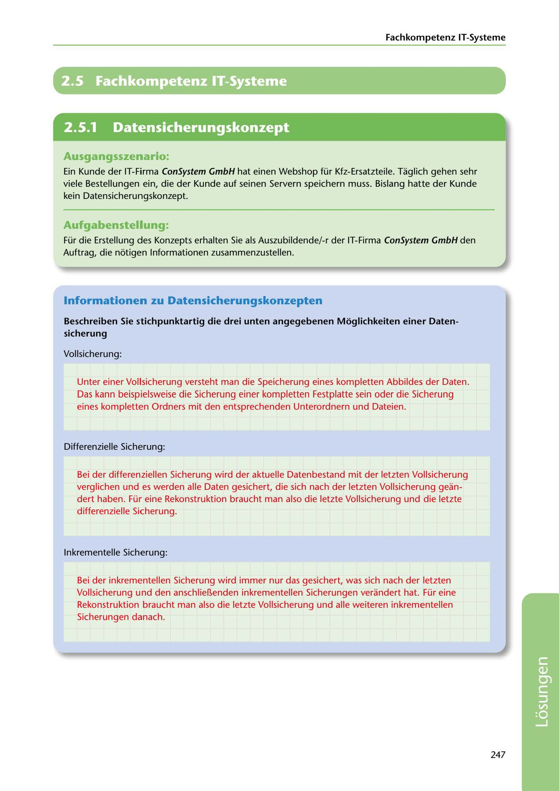

---
## Page 249
---

Fachkompetenz IT-Systerne

# 2.5 Fachkompetenz IT-Systeme

<!-- IMAGE: page-249-img-1.jpeg - TODO: Add description -->

**[VISUAL: CONSYSTEM GMBH SOLUTION HEADER]**
Header image for the ConSystem GmbH data backup concepts solutions section.

## Ausgangsszenario:

Ein Kunde der IT-Firma ConSystem GmbH hat einen Webshop für Kfz-Ersatzteile. Taglich gehen sehr viele Bestellungen ein, die der Kunde auf seinen Servern speichern muss. Bislang hatte der Kunde kein Datensicherungskonzept.

## Aufgabenstellung.

Für die Erstellung des Konzepts erhalten Sie als Auszubildende/-r der IT-Firma ConSystem GmbH den Auftrag, die notigen lnformationen zusammenzustellen.

## lnformationen zu Datensicherungskonzepten

### sicherung

Beschreiben Sie stichpunktartig die drei unten angegebenen Moglichkeiten einer Daten-

Vollsicherung:

Unter einer Vollsicherung versteht man die Speicherung eines kompletten Abbildes der Daten. Das kann beispielsweise die Sicherung einer kompletten Festplatte sein oder die Sicherung eines kompletten Ordners mit den entsprechenden Unterordnern und Dateien.

Differenzielle Sicherung:

Bei der differenziellen Sicherung wird der aktuelle Datenbestand mit der letzten Vollsicherung verglichen und es werden alle Daten gesichert, die sich nach der letzten Vollsicherung gean- dert haben. Für eine Rekonstruktion braucht man also die letzte Vollsicherung und die letzte differenzielle Sicherung.

lnkrementelle Sicherung:

Bei der inkrementellen Sicherung wird immer nur das gesichert, was sich nach der letzten Vollsicherung und den anschlie~enden inkrementellen Sicherungen verandert hat. Für eine

Rekonstruktion braucht man also die letzte Vollsicherung und alle weiteren inkrementellen Sicherungen danach.

247

**[VISUAL: CONSYSTEM GMBH SOLUTION HEADER]**
Header image for the ConSystem GmbH data backup concepts solutions section.
