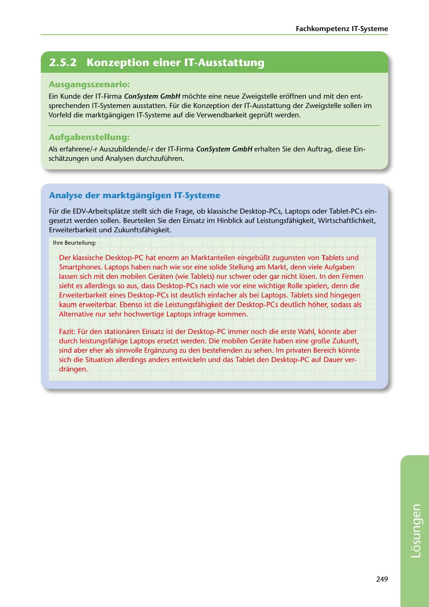

---
## Page 251
---

Fachkompetenz IT-Systerne

<!-- IMAGE: page-251-img-1.jpeg - TODO: Add description -->

**[VISUAL: CONSYSTEM GMBH SOLUTION HEADER]**
Header image for the ConSystem GmbH IT systems analysis solutions section.

### Ausgangsszenario:

Ein Kunde der IT-Firma ConSystem GmbH mochte eine neue Zweigstelle eroffnen und mit den ent- sprechenden IT-Systemen ausstatten. Für die Konzeption der IT-Ausstattung der Zweigstelle sollen im Vorfeld die marktgangigen IT-Systeme auf die Verwendbarkeit geprüft werden.

### Aufgabenstellung:

Als erfahrene/-r Auszubildende/-r der IT-Firma ConSystem GmbH erhalten Sie den Auftrag, diese Ein- schatzungen und Analysen durchzuführen.

## Analyse der marktgangigen IT-Systeme

Für die EDV-Arbeitsplatze stellt sich die Frage, ob klassische Desktop-PCs, Laptops oder Tablet-PCs ein- gesetzt werden sollen. Beurteilen Sie den Einsatz im Hinblick auf Leistungsfühigkeit, Wirtschaftlichkeit, Erweiterbarkeit und Zukunftsfühigkeit.

lhre Beurteilung:

Der klassische Desktop-PC hat enorm an Marktanteilen eingebü[l,t zugunsten von Tablets und Smartphones. Laptops haben nach wie vor eine solide Stellung am Markt, denn viele Aufgaben lassen sich mit den mobilen Geraten (wie Tablets) nur schwer oder gar nicht losen. In den Firmen sieht es allerdings so aus, dass Desktop-PCs nach wie vor eine wichtige Rolle spielen, denn die Erweiterbarkeit eines Desktop-PCs ist deutlich einfacher als bei Laptops. Tablets sind hingegen kaum erweiterbar. Ebenso ist die Leistungsfahigkeit der Desktop-PCs deutlich hoher, sodass als Alternative nur sehr hochwertige Laptops infrage kommen.

Fazit: Für den stationaren Einsatz ist der Desktop-PC immer noch die erste Wahl, konnte aber durch leistungsfahige Laptops ersetzt werden. Die mobilen Gerate haben eine groí.\e Zukunft, sind aber eher als sinnvolle Erganzung zu den bestehenden zu sehen. lm privaten Bereich konnte sich die Situation allerdings anders entwickeln und das Tablet den Desktop-PC auf Dauer ver- drangen.

249

**[VISUAL: CONSYSTEM GMBH SOLUTION HEADER]**
Header image for the ConSystem GmbH IT systems analysis solutions section.
