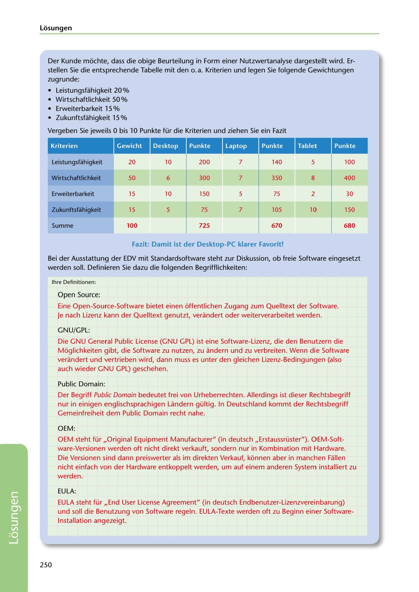

---
## Page 252
---

Losungen

Der Kunde mochte, dass die obige Beurteilung in Form einer Nutzwertanalyse dargestellt wird. Er- stellen Sie die entsprechende Tabelle mit den o. a. Kriterien und legen Sie folgende Gewichtungen zugrunde:

• Leistungsfahigkeit 20 o/o • Wirtschaftlichkeit 50 o/o • Erweiterbarkeit 15 o/o • Zukunftsfahigkeit 15 o/o

Vergeben Sie jewe1ils O bis 1 O Punkte für die Kriterien und ziehen Sie ein Fazit

<!-- IMAGE: page-252-img-1.jpeg - TODO: Add description -->

Leistungsfohigkeit 20 10 200 7 140 5 100

### Kriterien

# 13%ílilf·&Ui◄all.. .. ..

### Wirtschaftlichkeit

50 6 300 7 350 8 400

Erweiterbarkeit 15 10 150 5 75 2 30

### Zukunftsfohigkeit

15 5 75 7 105 10 150

### 100

### 725

### 670

### 680

Summe

### Fazit: Darnit ist der Desktop-PC klarer Favorit!

Bei der Ausstattung der EDV mit Standardsoftware steht zur Diskussion, ob freie Software eingesetzt werden soll. Definieren Sie dazu die folgenden Begrifflichkeiten:

lhre Definitionen:

Open Source:

Eine Open-Source-Software bietet einen offentlichen Zugang zum Quelltext der Software. Je nach Lizenz kann der Quelltext genutzt, verandert oder weiterverarbeitet werden.

GNU/GPL:

Die GNU General Public License (GNU GPL) ist eine Software-Lizenz, die den Benutzern die Moglichkeiten gibt, die Software zu nutzen, zu andern und zu verbreiten. Wenn die Software verandert und vertrieben wird, dann muss es unter den gleichen Lizenz-Bedingungen (also auch wieder GNU GPL) geschehen.

Public Domain:

Der Begriff Public Domain bedeutet frei van Urheberrechten. Allerdings ist dieser Rechtsbegriff nur in einigen englischsprachigen Landern gültig. In Deutschland kommt der Rechtsbegriff Gemeinfreiheit dem Public Domain recht nahe.

OEM:

OEM steht für 11Original Equipment Manufacturer" (in deutsch ,,Erstaussrüster"). OEM-Soft- ware-Versionen werden oft nicht direkt verkauft, sondern nur in Kombination mit Hardware. Die Versionen sind dann preiswerter als im direkten Verkauf, konnen aber in manchen Fallen nicht einfach von der Hardware entkoppelt werden, um auf einem anderen System installiert zu werden.

EULA:

EULA steht für ,,End User License Agreement" (in deutsch Endbenutzer-Lizenzvereinbarung) und soll die Benutzung van Software regeln. EULA-Texte werden oft zu Beginn einer Software- lnstallation angezeigt.

250

**[VISUAL: UTILITY VALUE ANALYSIS TABLE - SOLUTION]**
A completed utility value analysis (Nutzwertanalyse) comparing Desktop-PC, Laptop, and Tablet across four criteria: Leistungsfähigkeit (20%), Wirtschaftlichkeit (50%), Erweiterbarkeit (15%), and Zukunftsfähigkeit (15%). Scores show Desktop-PC with 725 points as the clear winner, followed by Tablet (680) and Laptop (670).
