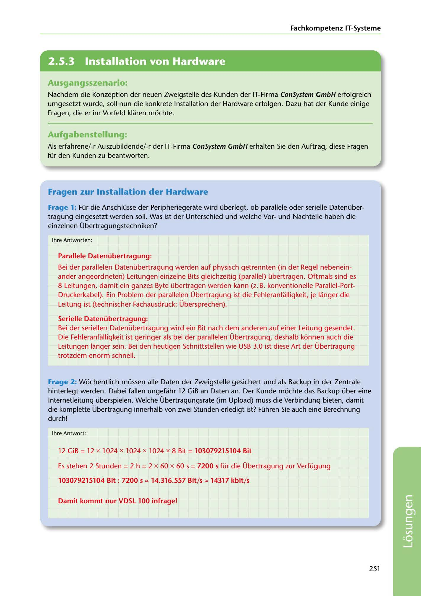

---
## Page 253
---

Fachkompetenz IT-Systerne

<!-- IMAGE: page-253-img-1.jpeg - TODO: Add description -->

**[VISUAL: CONSYSTEM GMBH SOLUTION HEADER]**
Header image for the ConSystem GmbH hardware installation solutions section.

### Ausgangsszenario:

Nachdem die Konzeption der neuen Zweigstelle des Kunden der IT-Firma ConSystem GmbH erfolgreich umgesetzt wurde, soll nun die konkrete lnstallation der Hardware erfolgen. Dazu hat der Kunde einige Fragen, die er irn Vorfeld klaren mi::ichte.

### Aufgabenstellung:

Als erfahrene/-r Auszubildende/-r der IT-Firma ConSystem GmbH erhalten Sie den Auftrag, diese Fragen für den Kunden zu beantworten.

## Fragen zur lnstallation der Hardware

Frage 1: Für die Anschlüsse der Peripheriegerate wird überlegt, ob parallele oder serielle Datenüber- tragung eingesetzt werden soll. Was ist der Unterschied und welche Vorund Nachteile haben die einzelnen Übertragungstechniken?

lhre Antworten:

### Parallele Datenübertragung:

Bei der parallelen Datenübertragung werden auf physisch getrennten (in der Regel nebenein- ander angeordneten) Leitungen einzelne Bits gleichzeitig (parallel) übertragen. Oftmals sind es 8 Leitungen, damit ein ganzes Byte übertragen werden kann (z. B. konventionelle Parallel-Port- Druckerkabel). Ein Problem der parallelen Übertragung ist die Fehleranfalligkeit, je langer die Leitung ist (technischer Fachausdruck: Übersprechen).

### Serielle Datenübertragung:

Bei der seriellen Datenübertragung wird ein Bit nach dem anderen auf einer Leitung gesendet. Die Fehleranfalligkeit ist geringer als bei der parallelen Übertragung, deshalb ki::innen auch die Leitungen langer sein. Bei den heutigen Schnittstellen wie USB 3.0 ist diese Art der Übertragung trotzdem enorm schnell.

Frage 2: Wi::ichentlich müssen alle Daten der Zweigstelle gesichert und als Backup in der Zentrale hinterlegt werden. Dabei fallen ungefahr 12 GiB an Daten an. Der Kunde mi::ichte das Backup über eine lnternetleitung überspielen. Welche Übertragungsrate (im Upload) muss die Verbindung bieten, damit die komplette Übertragung innerhalb von zwei Stunden erledigt ist? Führen Sie auch eine Berechnung durch!

lhre Antwort:

### 12 GiB = 12 x 1024 x 1024 x 1024 x 8 Bit = 103079215104 Bit

Es stehen 2 Stunden = 2 h = 2 x 60 x 60 s = 7200 s für die Übertragung zur Verfügung

### 103079215104 Bit : 7200 s z 14.316.557 Bit/s z 14317 kbit/s

### Darnit kommt nur VDSL 100 infrage!

251

**[VISUAL: CONSYSTEM GMBH SOLUTION HEADER]**
Header image for the ConSystem GmbH hardware installation solutions section.
