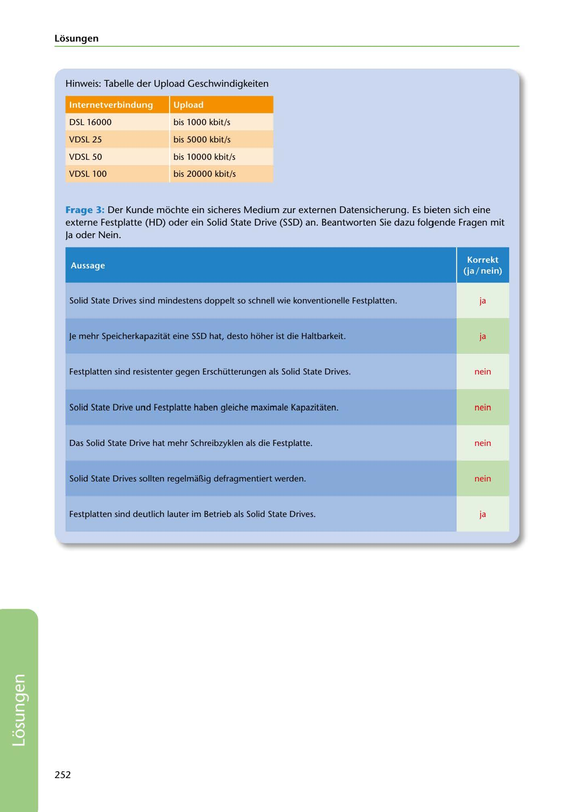

---
## Page 254
---

Losungen

Hinweis: Tabelle der Upload Geschwindigkeiten

lnternctverbinilung

<!-- IMAGE: page-254-img-1.jpeg - TODO: Add description -->

OSL 16000

bis 1000 kbit/s

VOSL 25

bis 5000 kbit/s

VOSL 50

bis 10000 kbit/s

VOSL 100

bis 20000 kbit/s

Frage 3: Der Kunde mochte ein sicheres Medium zur externen Datensicherung. Es bieten sich eine externe Festplatte (HD) oder ein Solid State Orive (SSD) an. Beantworten Sie dazu folgende Fragen mit

Ja oder Nein.

# •

Aussage Solid State Orives sind mindestens doppelt so schnell wie konventionelle Festplatten. ja

Je mehr Speicherkapazitat eine SSD hat, desto hoher ist die Haltbarkeit. ja

Festplatten sind resistenter gegen Erschütterungen als Solid State Orives. nein

Solid State Drive und Festplatte haben gleiche maximale Kapazitaten. nein

Das Solid State Orive hat mehr Schreibzyklen als die Festplatte. nein

Solid State Orives sollten regelmaBig defragmentiert werden. nein

Festplatten sind deutlich lauter im Betrieb als Solid State Orives. ja

252

**[VISUAL: INTERNET CONNECTION UPLOAD SPEEDS TABLE - SOLUTION]**
Reference table showing upload speeds for different internet connection types: DSL 16000 (up to 1000 kbit/s), VDSL 25 (up to 5000 kbit/s), VDSL 50 (up to 10000 kbit/s), and VDSL 100 (up to 20000 kbit/s).
