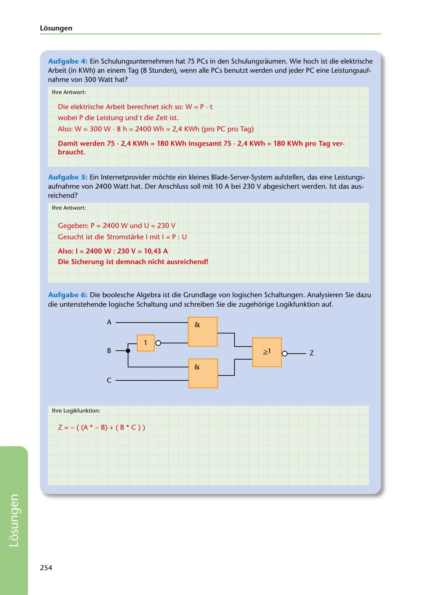

---
## Page 256
---

Losungen

Aufgabe 4: Ein Schulungsunternehmen hat 75 PCs in den Schulungsraumen. Wie hoch ist die elektrische Arbeit (in KWh) an einem Tag (8 $tunden), wenn alle PCs benutzt werden und jeder PC eine Leistungsauf- nahme von 300 Watt hat?

lhre Antwort :

Die elektrische Arbeit berechnet sich so: W = P • t

wobei P die Leistung und t die Zeit ist.

Also: W = 300 W • 8 h = 2400 Wh = 2,4 KWh (pro PC pro Tag)

### braucht.

Damit werden 75 • 2,4 KWh = 180 KWh insgesamt 75 • 2,4 KWh = 180 KWh pro Tag ver-

Aufgabe 5: Ein lnternetprovider mi:ichte ein kleines Blade-Server-System aufstellen, das eine Leistungs- aufnahme von 2400 Watt hat. Der Anschluss soll mit 10 A bei 230 V abgesichert werden. 1st das aus- reichend?

lhre Antwort:

Gegeben: P = 2400 W und U = 230 V

Gesucht ist die Stromstarke I mit 1 = P : U

### Also: 1 = 2400 W : 230 V = 10,43 A

### Die Sicherung ist demnach nicht ausreichend!

Aufgabe 6: Die boolesche Algebra ist die Grundlage von logischen Schaltungen. Analysieren Sie dazu die untenstehende logische Schaltung und schreiben Sie die zugehi:irige Logikfunktion auf.

# A --------

& 1

## 1 lº >-------'L.___JI7___J

# 2!1 o-- z

1

# B ---r

# & l _JL_

# e--------

1

lhre Logikfunktion:

Z = - ( (A * - B) + ( B * C ) )

254

<!-- IMAGE: page-256-img-1.jpeg - TODO: Add description -->
