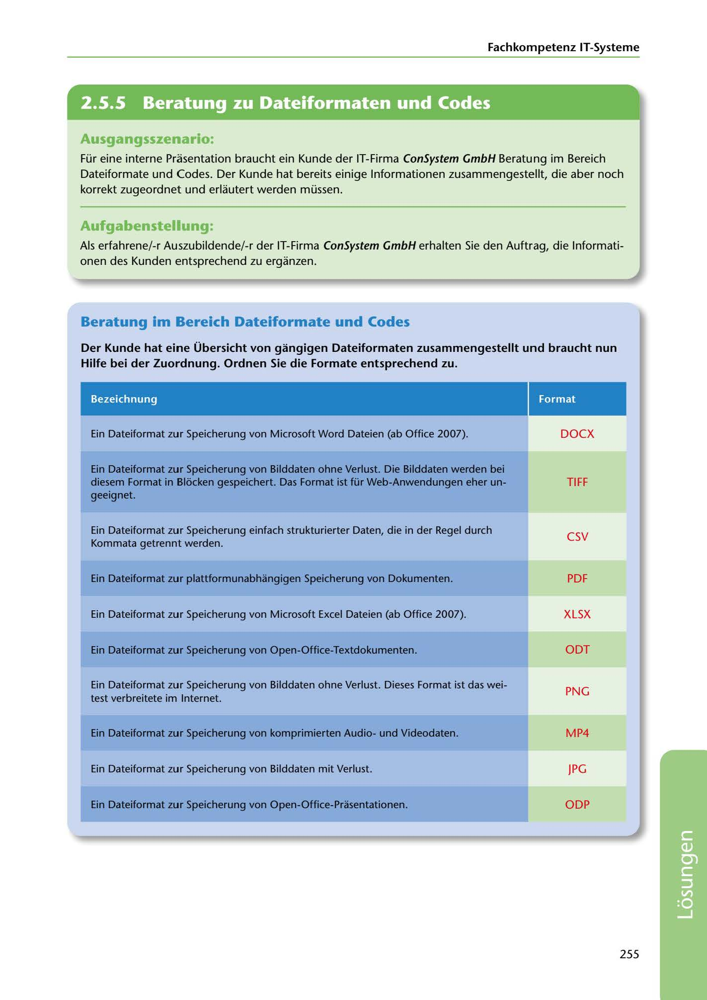

---
## Page 257
---

Fachkompetenz IT-Systerne

<!-- IMAGE: page-257-img-1.jpeg - TODO: Add description -->

**[VISUAL: CONSYSTEM GMBH SOLUTION HEADER]**
Header image for the ConSystem GmbH file formats and codes solutions section.

### Ausgangsszenario:

Für eine interne Prasentation braucht ein Kunde der IT-Firma ConSystem GmbH Beratung im Bereich Dateiforrnate und Codes. Der Kunde hat bereits einige lnformationen zusammengestellt, die aber noch korrekt zugeordnet und erlautert werden müssen.

### Aufgabenstellung:

Als erfahrene/-r Auszubildende/-r der IT-Firma ConSystem GmbH erhalten Sie den Auftrag, die lnformati- onen des Kunden entsprechend zu erganzen.

## Beratung im Bereich Dateiformate und Codes

Der Kunde hat eine Übersicht von gangigen Dateiformaten zusammengestellt und braucht nun Hilfe bei der Zuordnung. Ordnen Sie die Formate entsprechend zu.

Bezeichnung

Format

Ein Dateiformat zur Speicherung von Microsoft Word Dateien (ab Office 2007).

DOCX

TIFF

Ein Dateiformat zur Speicherung von Bilddaten ohne Verlust. Die Bilddaten werden bei diesem Format in Blocken gespeichert. Das Format ist für Web-Anwendungen eher un- geeignet.

# csv

Ein Dateiformat zur Speicherung einfach strukturierter Daten, die in der Regel durch Kommata getrennt werden.

Ein Dateiformat zur plattformunabhangigen Speicherung von Dokumenten.

PDF

Ein Dateiformat zur Speicherung von Microsoft Excel Dateien (ab Office 2007).

XLSX

Ein Dateiformat zur Speicherung von Open-Office-Textdokumenten.

ODT

PNG

Ein Dateiformat zur Speicherung von Bilddaten ohne Verlust. Dieses Format ist das wei- test verbreitete im Internet.

Ein Dateiformat zur Speicherung von komprimierten Audiound Videodaten.

MP4

Ein Dateiformat zur Speicherung von Bilddaten mit Verlust.

JPG

Ein Dateiformat zur Speicherung von Open-Office-Prasentationen.

ODP

255

**[VISUAL: CONSYSTEM GMBH SOLUTION HEADER]**
Header image for the ConSystem GmbH file formats and codes solutions section.
