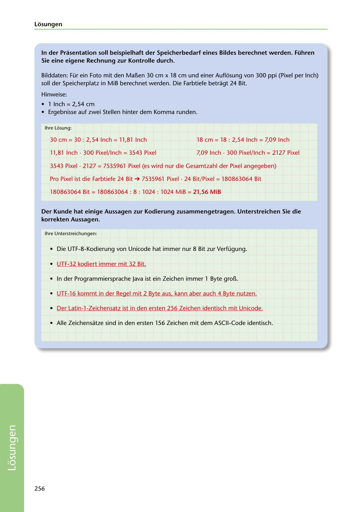

---
## Page 258
---

Losungen

### Sie eine eigene Rechnung zur Kontrolle durch.

In der Prasentation soll beispielhaft der Speicherbedarf eines Bildes berechnet werden. Führen

Bilddaten: Für ein Foto mit den Ma~en 30 cm x 18 cm und einer Auflosung von 300 ppi (Pixel per lnch) soll der Speicherplatz in MiB berechnet werden. Die Farbtiefe betragt 24 Bit.

Hinweise:

• 1 lnch = 2,54 cm • Ergebnisse auf zwei Stellen hinter dem Komma runden.

lhre Losung:

30 cm = 30: 2,54 lnch = 11,81 lnch

18 cm = 18: 2,54 lnch = 7,09 lnch

11,81 lnch • 300 Pixel/lnch = 3543 Pixel

7,09 lnch • 300 Pixel/lnch = 2127 Pixel

3543 Pixel• 2127 = 7535961 Pixel (es wird nur die Gesamtzahl der Pixel angegeben)

Pro Pixel ist die Farbtiefe 24 Bit ➔ 7535961 Pixel • 24 Bit/ Pixel = 180863064 Bit

### 180863064 Bit= 180863064: 8 : 1024 : 1024 MiB = 21,56 MiB

### korrekten Aussagen.

Der Kunde hat einige Aussagen zur Kodierung zusammengetragen. Unterstreichen Sie die

lhre Unterstreichungen:

• Die UTF-8-Kodierung von Unicode hat immer nur 8 Bit zur Verfügung.

• UTF-32 kodiert immer mit 32 Bit.

• In der Programmiersprache Java ist ein Zeichen immer 1 Byte gro~.

• UTF-16 kommt in der Regel mit 2 Byte aus. kann aber auch 4 Byte nutzen.

• Der Latin-1-Zeichensatz ist in den ersten 256 Zeichen identisch mit Unicode.

• Alle Zeichensatze sind in den ersten 156 Zeichen mit dem ASCII-Code identisch.

256

<!-- IMAGE: page-258-img-1.jpeg - TODO: Add description -->
