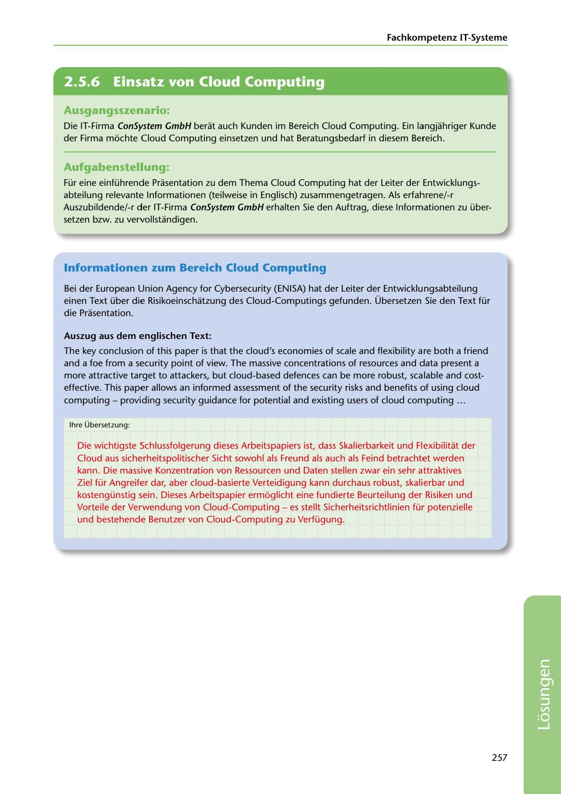

---
## Page 259
---

Fachkompetenz IT-Systerne

<!-- IMAGE: page-259-img-1.jpeg - TODO: Add description -->

**[VISUAL: CONSYSTEM GMBH SOLUTION HEADER]**
Header image for the ConSystem GmbH cloud computing solutions section.

### Ausgangsszenario:

Die IT-Firma ConSystem GmbH berat auch Kunden im Bereich Cloud Computing. Ein langjahriger Kunde der Firma mochte Cloud Computing einsetzen und hat Beratungsbedarf in diesem Bereich.

### Aufgabenstellung:

Für eine einführende Prasentation zu dem Thema Cloud Computing hat der Leiter der Entwicklungs- abteilung relevante lnformationen (teilweise in Englisch) zusammengetragen. Als erfahrene/-r Auszubildende/-r der IT-Firma ConSystem GmbH erhalten Sie den Auftrag, diese lnformationen zu über- setzen bzw. zu vervollstandigen.

### lnformationen zum Bereich Cloud Computing

Bei der European Union Agency far Cybersecurity (ENISA) hat der Leiter der Entwicklungsabteilung einen Text über die Risikoeinschatzung des Cloud-Computings gefunden. Übersetzen Sie den Text für die Prasentation.

### Auszug aus dem englischen Text:

The key conclusion of this paper is that the cloud's economies of scale and flexibility are both a friend and a foe from a security point of view. The massive concentrations of resources and data present a more attractive target to attackers, but cloud-based defences can be more robust, scalable and cost- effective. This paper allows an informed assessment of the security risks and benefits of using cloud computing - providing security guidance far potential and existing users of cloud computing ...

lhre Übersetzung:

Die wichtigste Schlussfolgerung dieses Arbeitspapiers ist, dass Skalierbarkeit und Flexibilitat der Cloud aus sicherheitspolitischer Sicht sowohl als Freund als auch als Feind betrachtet werden kann. Die mass1ive Konzentration van Ressourcen und Daten stellen zwar ein sehr attraktives Ziel für Angreifer dar, aber cloud-basierte Verteidigung kann durchaus robust, skalierbar und kostengünstig sein. Dieses Arbeitspapier ermoglicht eine fundierte Beurteilung der Risiken und Vorteile der Verwendung van Cloud-Computing - es stellt Sicherheitsrichtlinien für potenzielle

und bestehende Benutzer van Cloud-Computing zu Verfügung.

257

**[VISUAL: CONSYSTEM GMBH SOLUTION HEADER]**
Header image for the ConSystem GmbH cloud computing solutions section.
