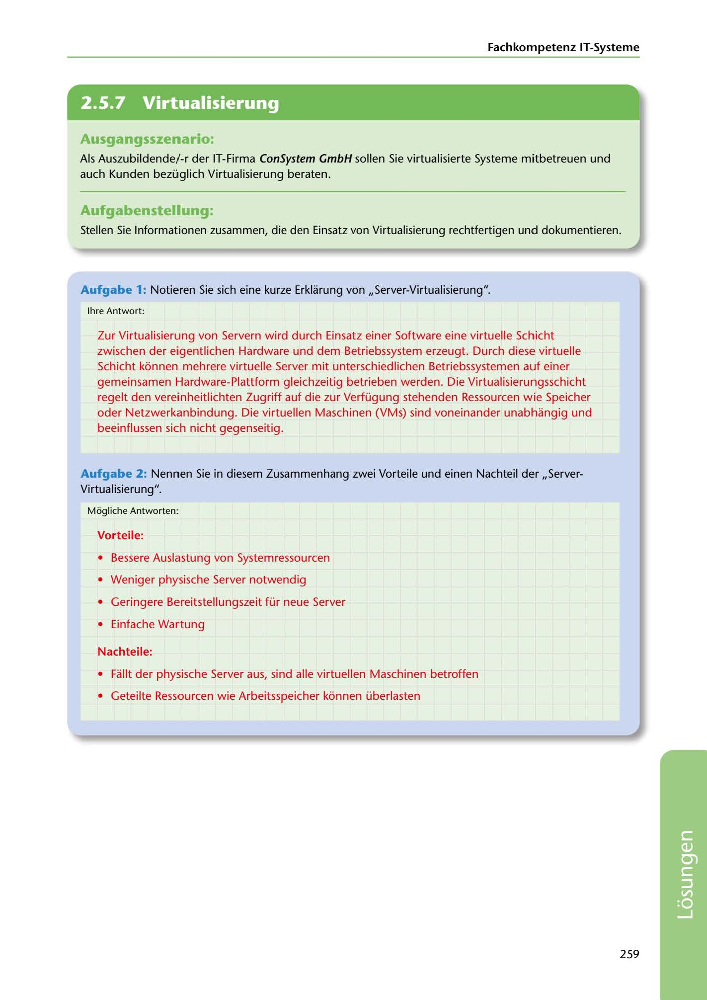

---
## Page 261
---

Fachkompetenz IT-Systerne

<!-- IMAGE: page-261-img-1.jpeg - TODO: Add description -->

**[VISUAL: CONSYSTEM GMBH SOLUTION HEADER]**
Header image for the ConSystem GmbH virtualization solutions section.

## Ausgangsszenario:

Als Auszubildende/-r der IT-Firma ConSystem GmbH sallen Sie virtualisierte Systeme mitbetreuen und auch Kunden bezüglich Virtualisierung beraten.

## Aufgabenstellung:

Stellen Sie lnformationen zusammen, die den Einsatz von Virtualisierung rechtfertigen und dokumentieren.

Aufgabe 1: Notieren Sie sich eine kurze Erklarung von ,,Server-Virtualisierung".

lhre Antwort:

Zur Virtualisierung von Servern wird durch Einsatz einer Software eine virtuelle Schicht zwischen der eigentlichen Hardware und dem Betriebssystem erzeugt. Durch diese virtuelle Schicht konnen mehrere virtuelle Server mit unterschiedlichen Betriebssystemen auf einer gemeinsamen Hardware-Plattform gleichzeitig betrieben werden. Die Virtualisierungsschicht regelt den vereinheitlichten Zugriff auf die zur Verfügung stehenden Ressourcen wie Speicher oder Netzwerkanbindung. Die virtuellen Maschinen (VMs) sind voneinander unabhangig und beeinflussen sich nicht gegenseitig.

Aufgabe 2: Nennen Sie in diesem Zusammenhang zwei Vorteile und einen Nachteil der ,,Server- Virtualisierung".

Mogliche Antworten:

### Vorteile:

• Bessere Auslastung von Systemressourcen

• Weniger physische Server notwendig

• Geringere Bereitstellungszeit für neue Server

• Einfache Wartung

### Nachteile:

• Fallt der physische Server aus, sind alle virtuellen Maschinen betroffen

• Geteilte Ressourcen wie Arbeitsspeicher konnen überlasten

259

**[VISUAL: CONSYSTEM GMBH SOLUTION HEADER]**
Header image for the ConSystem GmbH virtualization solutions section.
