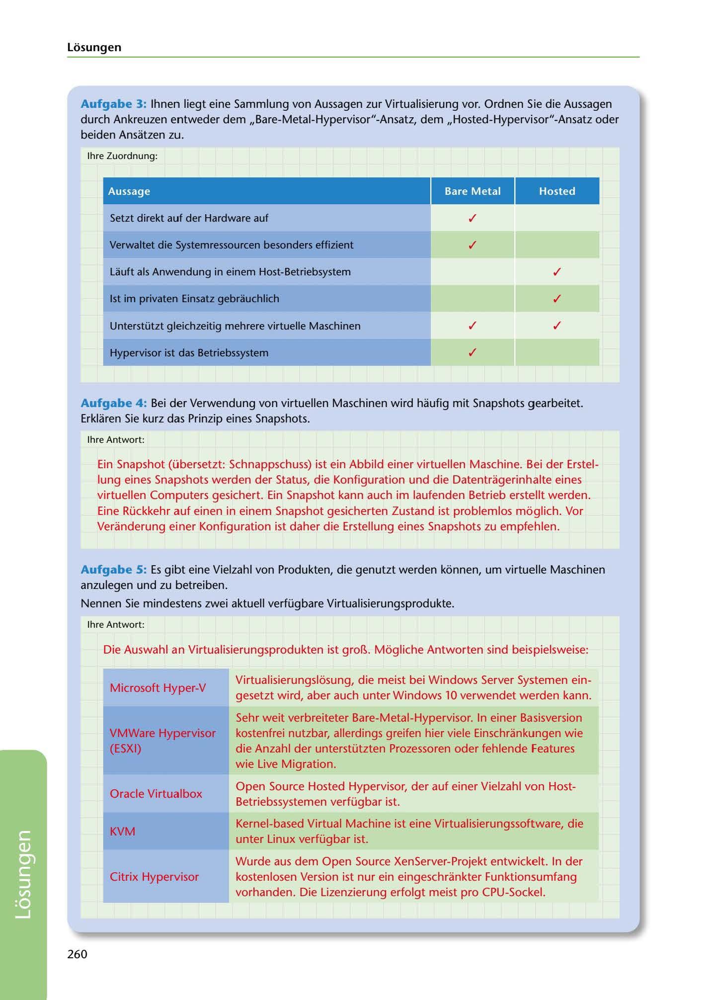

---
## Page 262
---

Losungen

Aufgabe 3: lhnen liegt eine Sammlung von Aussagen zur Virtualisierung vor. Ordnen Sie die Aussagen durch Ankreuzen entweder dem 11Bare-Metal-Hypervisor"-Ansatz, dem 11Hosted-Hypervisor"-Ansatz oder beiden Ansatzen zu.

lhre Zuordnung:

### Aussage

### Bare Metal

### Hosted

Setzt direkt auf der Hardware auf ✓

Verwaltet die Systemressourcen besonders effizient ✓

Lauft als Anwendung in einem Host-Betriebsystem ✓

1st im privaten Einsatz gebrauchlich ✓

Unterstützt gleichzeitig mehrere virtuelle Maschinen ✓ ✓

Hypervisor ist das Betriebssystem ✓

Aufgabe 4 : Bei der Verwendung von virtuellen Maschinen wird haufig mit Snapshots gearbeitet. Erklaren Sie kurz das Prinzip eines Snapshots.

lhre Antwort:

Ein Snapshot (übersetzt: Schnappschuss) ist ein Abbild einer virtuellen Maschine. Bei der Erstel- lung eines Snapshots werden der Status, die Konfiguration und die Datentragerinhalte eines virtuellen Computers gesichert. Ein Snapshot kann auch im laufenden Betrieb erstellt werden.

Eine Rückkehr auf einen in einem Snapshot gesicherten Zustand ist problemlos moglich. Vor Veranderung einer Konfiguration ist daher die Erstellung eines Snapshots zu empfehlen.

Aufgabe 5: Es gibt eine Vielzahl von Produkten, die genutzt werden konnen, um virtuelle Maschinen anzulegen und zu betreiben.

Nennen Sie mindestens zwei aktuell verfügbare Virtualisierungsprodukte.

lhre Antwort:

Die Auswahl an Virtualisierungsprodukten ist grol:l,. Mogliche Antworten sind beispielsweise:

Microsoft Hyper-V

Virtualisierungsli::isung, die meist bei Windows Server Systemen ein- gesetzt wird, aber auch unter Windows 10 verwendet werden kann.

VMWare Hypervisor (ESXI)

Sehr weit verbreiteter Bare-Metal-Hypervisor. In einer Basisversion kostenfrei nutzbar, allerdings greifen hier viele Einschrankungen wie die Anzahl der unterstützten Prozessoren oder fehlende Features wie Live Migration.

Oracle Virtualbox

Open Source Hosted Hypervisor, der auf einer Vielzahl von Host- Betriebssystemen verfügbar ist.

KVM

Kernel-based Virtual Machine ist eine Virtualisierungssoftware, die unter Linux verfügbar ist.

Wurde aus dem Open Source XenServer-Projekt entwickelt. In der

Citrix Hypervisor

kostenlosen Version ist nur ein eingeschrankter Funktionsumfang vorhanden. Die Lizenzierung erfolgt meist pro CPU-Sockel.

260

<!-- IMAGE: page-262-img-1.jpeg - TODO: Add description -->
