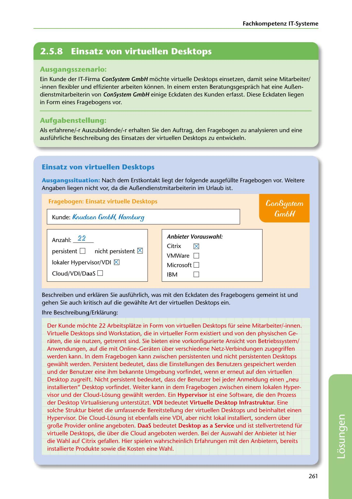

---
## Page 263
---

Fachkompetenz IT-Systerne

<!-- IMAGE: page-263-img-1.jpeg - TODO: Add description -->

**[VISUAL: CONSYSTEM GMBH SOLUTION HEADER]**
Header image for the ConSystem GmbH virtual desktop solutions section.

### Ausgangsszenario:

Ein Kunde der IT-Firma ConSystem GmbH mochte virtuelle Desktops einsetzen, damit seine Mitarbeiter/ -innen flexibler und effizienter arbeiten konnen. In einem ersten Beratungsgesprach hat eine Au~en- dienstmitarbeiterin van ConSystem GmbH einige Eckdaten des Kunden erfasst. Diese Eckdaten liegen in Form eines Fragebogens vor.

### Aufgabenstellung:

Als erfahrene/-r Auszubildende/-r erhalten Sie den Auftrag, den Fragebogen zu analysieren und eine ausführliche Beschreibung des Einsatzes der virtuellen Desktops zu entwickeln.

### Einsatz von virtuellen Desktops

Ausgangssituation: Nach dem Erstkontakt liegt der folgende ausgefüllte Fragebogen vor. Weitere Angaben liegen nicht vor, da die Au~endienstmitarbeiterin im Urlaub ist.

Fragebogen: Einsatz virtuelle Desktops

## Cnn8ystem

## GmóH

Kunde: f(nudsen GmbH, Hamburg

### Anbieter Vorauswahl:

Anzahl: 22

Citrix ~

## persistent D

nicht persistent IZl

## VMWare O

lokaler Hypervisor/VDI [gj

## Microsoft O

## Cloud/VDI/DaaS 0

## 0

IBM

Beschreiben und erklaren Sie ausführlich, was mit den Eckdaten des Fragebogens gemeint ist und gehen Sie auch kritisch auf die gewahlte Art der virtuellen Desktops ein.

lhre Beschreibung/Erklarung:

Der Kunde mochte 22 Arbeitsplatze in Form van virtuellen Desktops für seine Mitarbeiter/-innen. Virtuelle Desktops sind Workstation, die in virtueller Form existiert und van den physischen Ge- raten, die sie nutzen, getrennt sind. Sie bieten eine vorkonfigurierte Ansicht van Betriebssystem/ Anwendungen, auf die mit Online-Geraten über verschiedene Netz-Verbindungen zugegriffen werden kann. In dem Fragebogen kann zwischen persistenten und nicht persistenten Desktops gewahlt werden. Persistent bedeutet, dass die Einstellungen des Benutzers gespeichert werden und der Benutzer eine ihm bekannte Umgebung vorfindet, wenn er erneut auf den virtuellen Desktop zugreift. Nicht persistent bedeutet, dass der Benutzer bei jeder Anmeldung einen ,,neu installierten" Desktop vorfindet. Weiter kann in dem Fragebogen zwischen einem lokalen Hyper- visor und der Clloud-Losung gewahlt werden. Ein Hypervisor ist eine Software, die den Prozess der Desktop Virtualisierung unterstützt. VDI bedeutet Virtuelle Desktop lnfrastruktur. Eine solche Struktur bietet die umfassende Bereitstellung der virtuellen Desktops und beinhaltet einen Hypervisor. Die Cloud-Losung ist ebenfalls eine VDI, aber nicht lokal installiert, sondern über gro~e Provider online angeboten. DaaS bedeutet Desktop as a Service und ist stellvertretend für virtuelle Desktops, die über die Cloud angeboten werden. Bei der Auswahl der Anbieter ist hier die Wahl auf Citrix gefallen. Hier spielen wahrscheinlich Erfahrungen mit den Anbietern, bereits installierte Produkte sowie die Kosten eine Wahl.

261

**[VISUAL: CONSYSTEM GMBH SOLUTION HEADER]**
Header image for the ConSystem GmbH virtual desktop solutions section.
