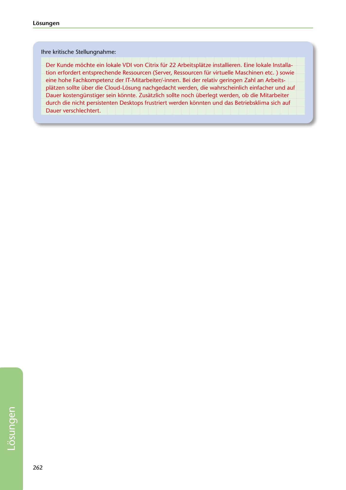

---
## Page 264
---

### Losungen

lhre kritische Stellungnahme:

Der Kunde mochte ein lokale VDI von Citrix für 22 Arbeitsplatze installieren. Eine lokale lnstalla- tion erfordert entsprechende Ressourcen (Server, Ressourcen für virtuelle Maschinen etc. ) sowie eine hohe Fachkompetenz der IT-Mitarbeiter/-innen. Bei der relativ geringen Zahl an Arbeits- platzen sollte über die Cloud-Losung nachgedacht werden, die wahrscheinlich einfacher und auf Dauer kostengünstiger sein konnte. Zusatzlich sollte noch überlegt werden, ob die Mitarbeiter durch die nicht persistenten Desktops frustriert werden konnten und das Betriebskli ma sich auf Dauer verschlechtert.

262

<!-- IMAGE: page-264-img-1.jpeg - TODO: Add description -->
