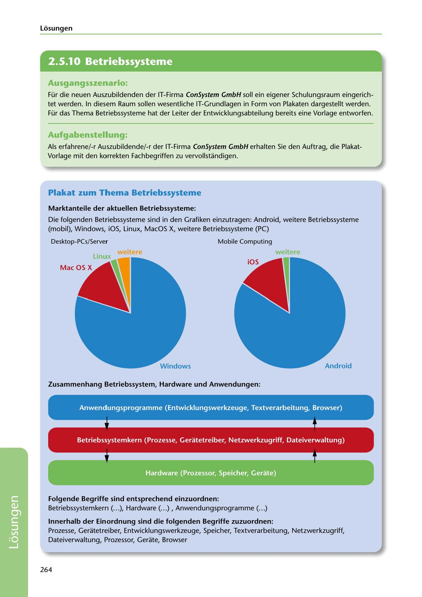

---
## Page 266
---

Losungen

<!-- IMAGE: page-266-img-1.jpeg - TODO: Add description -->

## Ausgangsszenario:

Für die neuen Auszubildenden der IT-Firma ConSystem GmbH soll ein eigener Schulungsraum eingerich- tet werden. In diesem Raum sallen wesentliche IT-Grundlagen in Form von Plakaten dargestellt werden. Für das Thema Betriebssysteme hat der Leiter der Entwicklungsabteilung bereits eine Vorlage entworfen.

## Aufgabenstellung:

Als erfahrene/-r Auszubildende/-r der IT-Firma ConSystem GmbH erhalten Sie den Auftrag, die Plakat- Vorlage mit den korrekten Fachbegriffen zu vervollstandigen.

## Plakat zum Thema Betriebssysteme

### Marktanteile der aktuellen Betriebssysteme:

Die folgenden Betriebssysteme sind in den Grafiken einzutragen: Android, weitere Betriebssysteme (mobil), Windows, iOS, Linux, Macos X, weitere Betriebssysteme (PC)

Desktop-PCs/Server Mobile Computing

### weitere

### v, ~itere

**[VISUAL: OPERATING SYSTEMS POSTER WITH PIE CHARTS - SOLUTION]**
Educational poster showing operating systems market share. Two pie charts display: Desktop/Server market (Windows dominant, with Linux, macOS X, and others) and Mobile Computing market (Android dominant, with iOS and others). Also includes a layered architecture diagram showing relationships between Hardware, Betriebssystemkern (OS kernel), and Anwendungsprogramme (applications), with associated components like Prozesse, Gerätetreiber, Speicher, Prozessor, and Gerate.

**[VISUAL: OPERATING SYSTEMS POSTER WITH PIE CHARTS - SOLUTION]**
Educational poster showing operating systems market share. Two pie charts display: Desktop/Server market (Windows dominant, with Linux, macOS X, and others) and Mobile Computing market (Android dominant, with iOS and others). Also includes a layered architecture diagram showing relationships between Hardware, Betriebssystemkern (OS kernel), and Anwendungsprogramme (applications), with associated components like Prozesse, Gerätetreiber, Speicher, Prozessor, and Gerate.

### Zusammenhang Betriebssystem, Hardware und Anwendungen:

**[VISUAL: OPERATING SYSTEMS POSTER WITH PIE CHARTS - SOLUTION]**
Educational poster showing operating systems market share. Two pie charts display: Desktop/Server market (Windows dominant, with Linux, macOS X, and others) and Mobile Computing market (Android dominant, with iOS and others). Also includes a layered architecture diagram showing relationships between Hardware, Betriebssystemkern (OS kernel), and Anwendungsprogramme (applications), with associated components like Prozesse, Gerätetreiber, Speicher, Prozessor, and Gerate.

**[VISUAL: OPERATING SYSTEMS POSTER WITH PIE CHARTS - SOLUTION]**
Educational poster showing operating systems market share. Two pie charts display: Desktop/Server market (Windows dominant, with Linux, macOS X, and others) and Mobile Computing market (Android dominant, with iOS and others). Also includes a layered architecture diagram showing relationships between Hardware, Betriebssystemkern (OS kernel), and Anwendungsprogramme (applications), with associated components like Prozesse, Gerätetreiber, Speicher, Prozessor, and Gerate.

### Folgende Begriffe sind entsprechend einzuordnen:

Betriebssystemkern ( ... ), Hardware ( ... ) , Anwendungsprogramme ( ... )

lnnerhalb der Einordnung sind die folgenden Begriffe zuzuordnen: Prozesse, Geratetreiber, Entwicklungswerkzeuge, Speicher, Textverarbeitung, Netzwerkzugriff, Dateiverwaltung, Prozessor, Gerate, Browser

264

**[VISUAL: OPERATING SYSTEMS POSTER WITH PIE CHARTS - SOLUTION]**
Educational poster showing operating systems market share. Two pie charts display: Desktop/Server market (Windows dominant, with Linux, macOS X, and others) and Mobile Computing market (Android dominant, with iOS and others). Also includes a layered architecture diagram showing relationships between Hardware, Betriebssystemkern (OS kernel), and Anwendungsprogramme (applications), with associated components like Prozesse, Gerätetreiber, Speicher, Prozessor, and Gerate.
