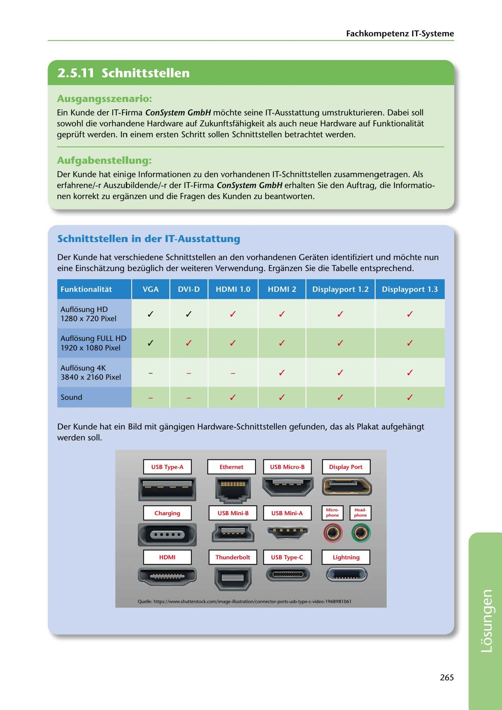

---
## Page 267
---

Fachkompetenz IT-Systerne

<!-- IMAGE: page-267-img-1.jpeg - TODO: Add description -->

**[VISUAL: HARDWARE INTERFACE CONNECTORS POSTER - SOLUTION]**
Visual reference poster showing common hardware interface connectors: USB Type-A, USB Micro-B, DisplayPort, USB Mini-A, USB Mini-B, Charging ports, HDMI, Thunderbolt, USB Type-C, and Lightning. Each connector is illustrated with its physical appearance for identification purposes.

## Ausgangsszenario:

Ein Kunde der IT-Firma ConSystem GmbH mochte seine IT-Ausstattung umstrukturieren. Dabei soll sowohl die vorhandene Hardware auf Zukunftsfahigkeit als auch neue Hardware auf Funktionalitat geprüft werden. In einem ersten Schritt sallen Schnittstellen betrachtet werden.

## Aufgabenstellung:

Der Kunde hat einige lnformationen zu den vorhandenen IT-Schnittstellen zusammengetragen. Als erfahrene/-r Auszubildende/-r der IT-Firma ConSystem GmbH erhalten Sie den Auftrag, die lnformatio- nen korrekt zu erganzen und die Fragen des Kunden zu beantworten.

## Schnittstellen in der IT-Ausstattung

Der Kunde hat verschiedene Schnittstellen an den vorhandenen Geraten identifiziert und mochte nun eine Einschatzung bezüglich der weiteren Verwendung. Erganzen Sie die Tabelle entsprechend.

Funktionalitat

Displayport 1.2 Displayport 1.3

# ---l··iiili·Fili·if ifi

✓ ✓ ✓ ✓

✓ ✓

Auflosung HD 1280 x 720 Pixel

### Auflosung FULL HD

✓ ✓

✓ ✓ ✓ ✓

### 1920 x 1080 Pixel

✓

✓ ✓

Auflosung 4K 3840 x 2160 Pixel

✓ ✓

✓ ✓

Sound

Der Kunde hat ein Bild mit gangigen Hardware-Schnittstellen gefunden, das als Plakat aufgehangt werden soll.

USB Type-A USB M icro-8 Display Port

**[VISUAL: HARDWARE INTERFACE CONNECTORS POSTER - SOLUTION]**
Visual reference poster showing common hardware interface connectors: USB Type-A, USB Micro-B, DisplayPort, USB Mini-A, USB Mini-B, Charging ports, HDMI, Thunderbolt, USB Type-C, and Lightning. Each connector is illustrated with its physical appearance for identification purposes.

**[VISUAL: HARDWARE INTERFACE CONNECTORS POSTER - SOLUTION]**
Visual reference poster showing common hardware interface connectors: USB Type-A, USB Micro-B, DisplayPort, USB Mini-A, USB Mini-B, Charging ports, HDMI, Thunderbolt, USB Type-C, and Lightning. Each connector is illustrated with its physical appearance for identification purposes.

# ------

- - - -

**[VISUAL: HARDWARE INTERFACE CONNECTORS POSTER - SOLUTION]**
Visual reference poster showing common hardware interface connectors: USB Type-A, USB Micro-B, DisplayPort, USB Mini-A, USB Mini-B, Charging ports, HDMI, Thunderbolt, USB Type-C, and Lightning. Each connector is illustrated with its physical appearance for identification purposes.

USB M ini-A

**[VISUAL: HARDWARE INTERFACE CONNECTORS POSTER - SOLUTION]**
Visual reference poster showing common hardware interface connectors: USB Type-A, USB Micro-B, DisplayPort, USB Mini-A, USB Mini-B, Charging ports, HDMI, Thunderbolt, USB Type-C, and Lightning. Each connector is illustrated with its physical appearance for identification purposes.

USB M ini-8 11

Charging 1

**[VISUAL: HARDWARE INTERFACE CONNECTORS POSTER - SOLUTION]**
Visual reference poster showing common hardware interface connectors: USB Type-A, USB Micro-B, DisplayPort, USB Mini-A, USB Mini-B, Charging ports, HDMI, Thunderbolt, USB Type-C, and Lightning. Each connector is illustrated with its physical appearance for identification purposes.

### i111

# • •

~~ HDMI Thunderbolt USB Type-C Lightning

**[VISUAL: HARDWARE INTERFACE CONNECTORS POSTER - SOLUTION]**
Visual reference poster showing common hardware interface connectors: USB Type-A, USB Micro-B, DisplayPort, USB Mini-A, USB Mini-B, Charging ports, HDMI, Thunderbolt, USB Type-C, and Lightning. Each connector is illustrated with its physical appearance for identification purposes.

**[VISUAL: HARDWARE INTERFACE CONNECTORS POSTER - SOLUTION]**
Visual reference poster showing common hardware interface connectors: USB Type-A, USB Micro-B, DisplayPort, USB Mini-A, USB Mini-B, Charging ports, HDMI, Thunderbolt, USB Type-C, and Lightning. Each connector is illustrated with its physical appearance for identification purposes.

**[VISUAL: HARDWARE INTERFACE CONNECTORS POSTER - SOLUTION]**
Visual reference poster showing common hardware interface connectors: USB Type-A, USB Micro-B, DisplayPort, USB Mini-A, USB Mini-B, Charging ports, HDMI, Thunderbolt, USB Type-C, and Lightning. Each connector is illustrated with its physical appearance for identification purposes.

Quelle: https://Www.shuttentock.com/image-iHustration/connector-pom-usl>-type<-video-1968981061

265

**[VISUAL: HARDWARE INTERFACE CONNECTORS POSTER - SOLUTION]**
Visual reference poster showing common hardware interface connectors: USB Type-A, USB Micro-B, DisplayPort, USB Mini-A, USB Mini-B, Charging ports, HDMI, Thunderbolt, USB Type-C, and Lightning. Each connector is illustrated with its physical appearance for identification purposes.
