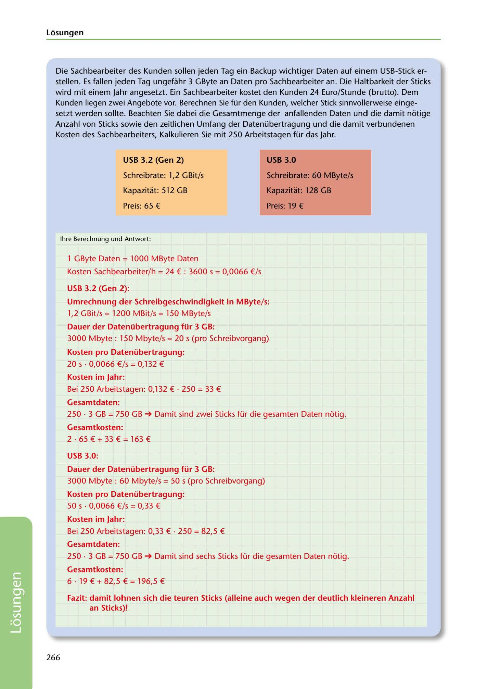

---
## Page 268
---

### Losungen

Die Sachbearbeiter des Kunden sollen jeden Tag ein Backup wichtiger Daten auf einem USB-Stick er- stellen. Es fallen jeden Tag ungefahr 3 GByte an Daten pro Sachbearbeiter an. Die Haltbarkeit der Sticks wird mit einem Jahr angesetzt. Ein Sachbearbeiter kostet den Kunden 24 Euro/Stunde (brutto). Dem Kunden liegen zwei Angebote vor. Berechnen Sie für den Kunden, welcher Stick sinnvollerweise einge- setzt werden sollte. Beachten Sie dabei die Gesamtmenge der anfallenden Daten und die damit notige Anzahl von Sticks sowie den zeitlichen Umfang der Datenübertragung und die damit verbundenen

Kosten des Sachbearbeiters, Kalkulieren Sie mit 250 Arbeitstagen für das Jahr.

### USB 3.0

### USB 3.2 (Gen 2)

Schreibrate: 1,2 GBit/s

### Schreibrate: 60 MByte/s

Kapazitat: 512 GB

### Kapazitat: 128 GB

Preis: 65 €

### Preis: 19 €

lhre Berechnung und Antwort:

1 GByte Daten = 1000 MByte Daten

Kosten Sachbearbeiter/ h = 24 € : 3600 s = 0,0066 €/s

### USB 3.2 (Gen 2):

### Umrechnung der Schreibgeschwindigkeit in MByte/ s:

1,2 GBit/s = 1200 MBit/s = 150 MByte/s

### Dauer der Datenübertragung für 3 GB:

3000 Mbyte : 150 Mbyte/s = 20 s (pro Schreibvorgang)

### Kosten pro Datenübertragung:

20 s • 0,0066 €/s = 0,132 €

### Kosten im Jahr:

Bei 250 Arbeitstagen: 0,132 € • 250 = 33 €

### Gesamtdaten:

250 • 3 GB = 750 GB ➔ Damit sind zwei Sticks für die gesamten Daten notig.

### Gesamtkosten:

2 - 65€ + 33€ = 163€

### USB 3.0:

### Dauer der Datenübertragung für 3 GB:

3000 Mbyte: 60 Mbyte/s = 50 s (pro Schreibvorgang)

### Kosten pro Datenübertragung:

50 s • 0,0066 €/s = 0,33 €

### Kosten im Jahr:

Bei 250 Arbeitstagen: 0,33 € • 250 = 82,5 €

### Gesamtdaten:

250 • 3 GB = 750 GB ➔ Damit sind sechs Sticks für die gesamten Daten notig.

### Gesamtkosten:

6 • 19 € + 82,5 € = 196,5 €

### an Sticks)!

Fazit: damit lohnen sich die teuren Sticks (alleine auch wegen der deutlich kleineren Anzahl

266

<!-- IMAGE: page-268-img-1.jpeg - TODO: Add description -->
