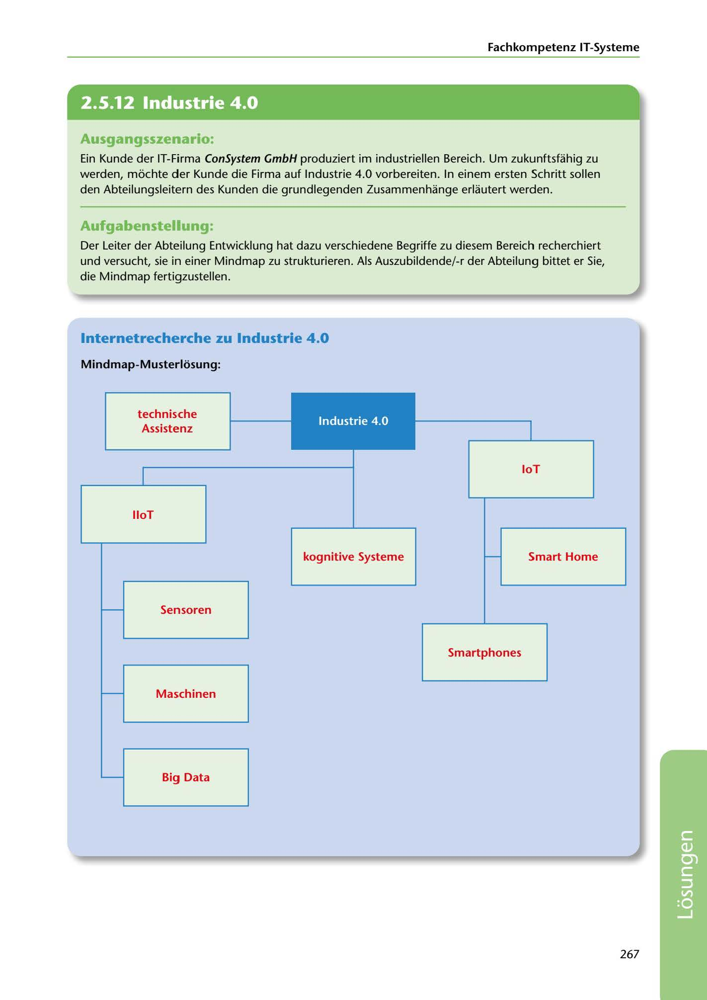

---
## Page 269
---

Fachkompetenz IT-Systerne

<!-- IMAGE: page-269-img-1.jpeg - TODO: Add description -->

## Ausgangsszenario:

Ein Kunde der IT-Firma ConSystem GmbH produziert im industriellen Bereich. Um zukunftsfahig zu werden, mochte der Kunde die Firma auf Industrie 4.0 vorbereiten. In einem ersten Schritt sollen den Abteilungsleitern des Kunden die grundlegenden Zusammenhange erlautert werden.

## Aufgabenstellung:

Der Leiter der Abteilung Entwicklung hat dazu verschiedene Begriffe zu diesem Bereich recherchiert und versucht, sie in einer Mindmap zu strukturieren. Als Auszubildende/-r der Abteilung bittet er Sie, die Mindmap fertigzustellen.

## lnternetrecherche zu Industrie 4.0

Mindmap-Musterlosung:

Industrie 4.0

technische Assistenz

loT

lloT

kognitive Systerne

Smart Home

Sensoren

Smartphones

Maschinen

Big Data

267

**[VISUAL: INDUSTRY 4.0 MINDMAP - SOLUTION]**
Completed mindmap showing Industry 4.0 concepts with branches for: IoT (Internet of Things), IIoT (Industrial Internet of Things), technische Assistenz (technical assistance), kognitive Systeme, Smart Home, Sensoren, Smartphones, Maschinen, and Big Data.
