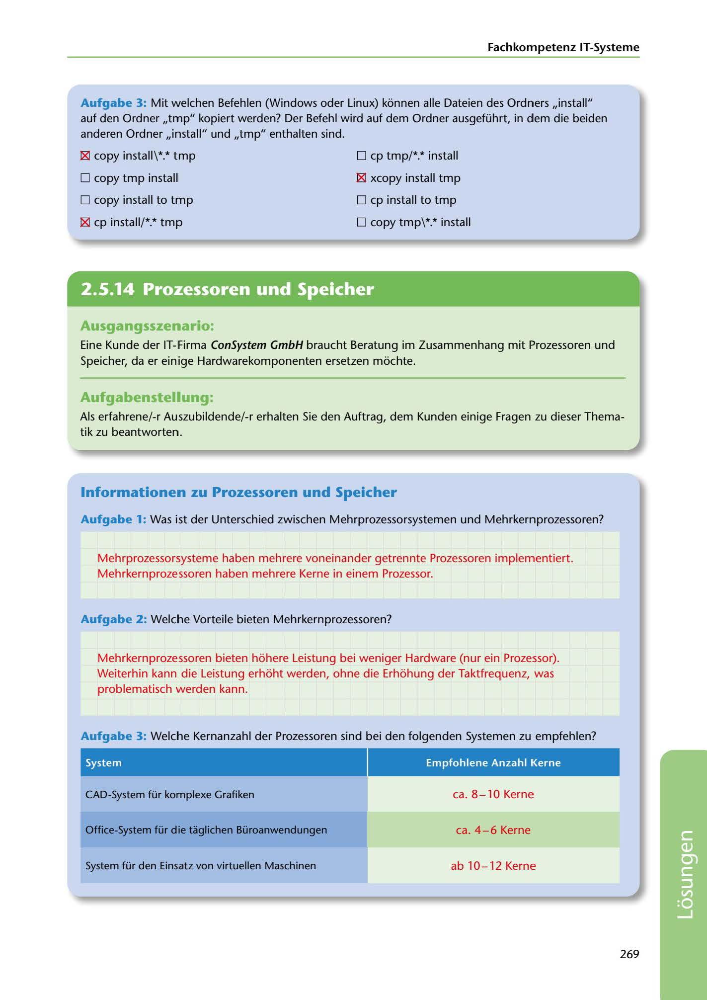

---
## Page 271
---

Fachkompetenz IT-Systerne

Aufgabe 3: Mit welchen Befehlen (Windows oder Linux) konnen alle Dateien des Ordners ,,install" auf den Ordner ,,tmp" kopiert werden? Der Befehl wird auf dem Ordner ausgeführt, in dem die beiden anderen Ordner ,,install" und ,,tmp" enthalten sind.

□ cp tmp/*.* install

### 181 copy install\ *.* tmp

O copy tmp installl

l8I xcopy install tmp

□ copy install to tmp

□ cp install to tmp

□ copy tmp\*.* install

181 cp install/*.* trnp

<!-- IMAGE: page-271-img-1.jpeg - TODO: Add description -->

## Ausgangsszenario:

Eine Kunde der IT-Firma ConSystem GmbH braucht Beratung im Zusarnmenhang mit Prozessoren und Speicher, da er einige Hardwarekomponenten ersetzen mochte.

## Aufgabenstellung:

Als erfahrene/-r Auszubildende/-r erhalten Sie den Auftrag, dem Kunden einige Fragen zu dieser Thema- tik zu beantworten.

## lnformationen zu Prozessoren und Speicher

Aufgabe 1: Was ist der Unterschied zwischen Mehrprozessorsystemen und Mehrkernprozessoren?

Mehrprozessorsysteme haben mehrere voneinander getrennte Prozessoren implementiert. Mehrkernprozessoren haben mehrere Kerne in einem Prozessor.

### Aufgabe 2: Welche Vorteile bieten Mehrkernprozessoren?

Mehrkernprozessoren bieten hohere Leistung bei weniger Hardware (nur ein Prozessor). Weiterhin kann die Leistung erhoht werden, ohne die Erhohung der Taktfrequenz, was

problematisch werden kann.

Aufgabe 3: Welche Kernanzahl der Prozessoren sind bei den folgenden Systemen zu empfehlen?

System Empfohlene Anzahl Kerne

CAD-System für komplexe Grafiken ca. 810 Kerne

Office-System für die taglichen Büroanwendungen ca. 46 Kerne

System für den Einsatz von virtuellen Maschinen ab 1012 Kerne

269

**[VISUAL: CONSYSTEM GMBH SOLUTION HEADER]**
Header image for the ConSystem GmbH processors and memory solutions section.
