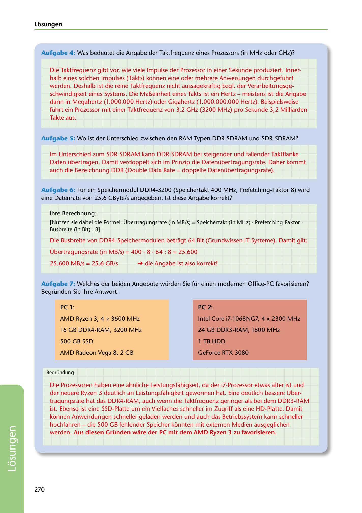

---
## Page 272
---

Losungen

Aufgabe 4 : Was bedeutet die Angabe der Taktfrequenz eines Prozessors (in MHz oder GHz)?

Die Taktfrequenz gibt vor, wie viele Impulse der Prozessor in einer Sekunde produziert. lnner- halb eines solchen Impulses (Takts) konnen eine oder mehrere Anweisungen durchgeführt werden. Deshalb ist die reine Taktfrequenz nicht aussagekraftig bzgl. der Verarbeitungsge- schwindigkeit eines Systems. Die Ma~einheit eines Takts ist ein Hertz - meistens ist die Angabe dann in Megahertz (1.000.000 Hertz) oder Gigahertz (1.000.000.000 Hertz). Beispielsweise führt ein Prozessor mit einer Taktfrequenz von 3,2 GHz (3200 MHz) pro Sekunde 3,2 Milliarden Takte aus.

Aufgabe 5: Wo ist der Unterschied zwischen den RAM-Typen DDR-SDRAM und SDR-SDRAM?

lm Unterschied zum SDR-SDRAM kann DDR-SDRAM bei steigender und fallender Taktflanke Daten übertragen. Damit verdoppelt sich im Prinzip die Datenübertragungsrate. Daher kommt auch die Bezeichnung DDR (Double Data Rate = doppelte Datenübertragungsrate).

Aufgabe 6: Für ein Speichermodul DDR4-3200 (Speichertakt 400 MHz, Prefetching-Faktor 8) wird eine Datenrate von 25,6 GByte/s angegeben. 1st diese Angabe korrekt?

lhre Berechnung:

[Nutzen sie dabei die Formel: Übertragungsrate (in MB/s) = Speichertakt (in MHz) • Prefetching-Faktor • Busbreite (in Bit) : 8)

Die Busbreite von DDR4-Speichermodulen betragt 64 Bit (Grundwissen IT-Systeme). Damit gilt:

Übertragungsrate (in MB/s) = 400 • 8 • 64 : 8 = 25.600

25.600 MB/s = 25,6 GB/s ➔ die Angabe ist also korrekt!

Aufgabe 7: Welches der beiden Angebote würden Sie für einen modernen Office-PC favorisieren? Begründen Sie lhre Antwort.

### PC 1:

### PC 2:

AMD Ryzen 3, 4 x 3600 MHz

### lntel Core i7-1068NG7, 4 x 2300 MHz

16 GB DDR4-RAM, 3200 MHz

### 24 GB DDR3-RAM, 1600 MHz

500 GB SSD

### 1 TB HDD

AMD Radeon Vega 8, 2 GB

### GeForce RTX 3080

Begründung:

Die Prozessoren haben eine ahnliche Leistungsfahigkeit, da der i7-Prozessor etwas alter ist und der neuere Ryzen 3 deutlich an Leistungsfahigkeit gewonnen hat. Eine deutlich bessere Über- tragungsrate hat das DDR4-RAM, auch wenn die Taktfrequenz geringer als bei dem DDR3-RAM ist. Ebenso ist eine SSD-Platte um ein Vielfaches schneller im Zugriff als eine HD-Platte. Damit konnen Anwendungen schneller geladen werden und auch das Betriebssystem kann schneller hochfahren - die 500 GB fehlender Speicher konnten mit externen Medien ausgeglichen werden. Aus diesen Gründen ware der PC mit dem AMD Ryzen 3 zu favorisieren.

270

<!-- IMAGE: page-272-img-1.jpeg - TODO: Add description -->
