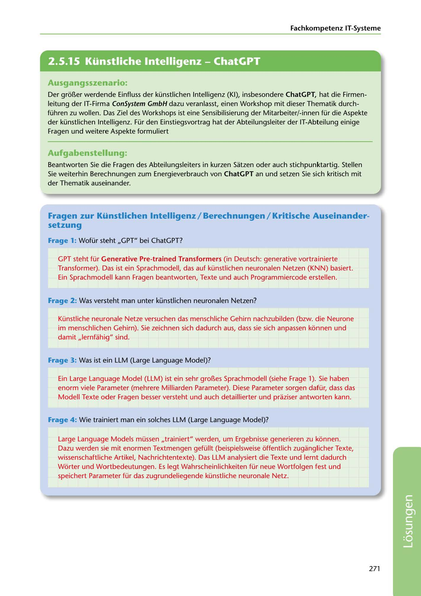

---
## Page 273
---

Fachkompetenz IT-Systerne

<!-- IMAGE: page-273-img-1.jpeg - TODO: Add description -->

## Ausgangsszenario:

Der gron.er werdende Einfluss der künstlichen lntelligenz (KI), insbesondere ChatGPT, hat die Firmen- leitung der IT-Firma ConSystem GmbH dazu veranlasst, einen Workshop mit dieser Thematik durch- führen zu wollen. Das Ziel des Workshops ist eine Sensibilisierung der Mitarbeiter/-innen für die Aspekte der künstlichen lntelligenz. Für den Einstiegsvortrag hat der Abteilungsleiter der IT-Abteilung einige Fragen und weitere Aspekte formuliert

## Aufgabenstellung:

Beantworten Sie die Fragen des Abteilungsleiters in kurzen Satzen oder auch stichpunktartig. Stellen Sie weiterhin Berechnungen zum Energieverbrauch von ChatGPT an und setzen Sie sich kritisch mit der Thematik auseinander.

## Fragen zur Künstlichen lntelligenz / Berechnungen / Kritische Auseinander-

## setzung

### Frage 1: Wofür steht ,,GPT" bei ChatGPT?

GPT steht für Generative Pre-trained Transforrners (in Deutsch: generative vortrainierte Transformer). Das ist ein Sprachmodell, das auf künstlichen neuronalen Netzen (KNN) basiert. Ein Sprachmodell kann Fragen beantworten, Texte und auch Programmiercode erstellen.

Frage 2: Was versteht man unter künstlichen neuronalen Netzen?

Künstliche neuronale Netze versuchen das menschliche Gehirn nachzubilden (bzw. die Neurone im menschlichen Gehirn). Sie zeichnen sich dadurch aus, dass sie sich anpassen konnen und damit ,,lernfahig" sind.

### Frage 3: Was ist ein LLM (Large Language Model)?

Ein Large Language Model (LLM) ist ein sehr gran.es Sprachmodell (siehe Frage 1). Sie haben enorm viele Parameter (mehrere Milliarden Parameter). Diese Parameter sorgen dafür, dass das Modell Texte oder Fragen besser versteht und auch detaillierter und praziser antworten kann.

Frage 4 : Wie trainiert man ein solches LLM (Large Language Model)?

Large Language Models müssen ,,trainiert" werden, um Ergebnisse generieren zu konnen. Dazu werden sie mit enormen Textmengen gefüllt (beispielsweise offentlich zuganglicher Texte, wissenschaftliche Artikel, Nachrichtentexte). Das LLM analysiert die Texte und lernt dadurch Worter und Wortbedeutungen. Es legt Wahrscheinlichkeiten für neue Wortfolgen fest und speichert Parameter für das zugrundeliegende künstliche neuronale Netz.

271

**[VISUAL: CONSYSTEM GMBH SOLUTION HEADER]**
Header image for the ConSystem GmbH artificial intelligence (KI/ChatGPT) solutions section.
