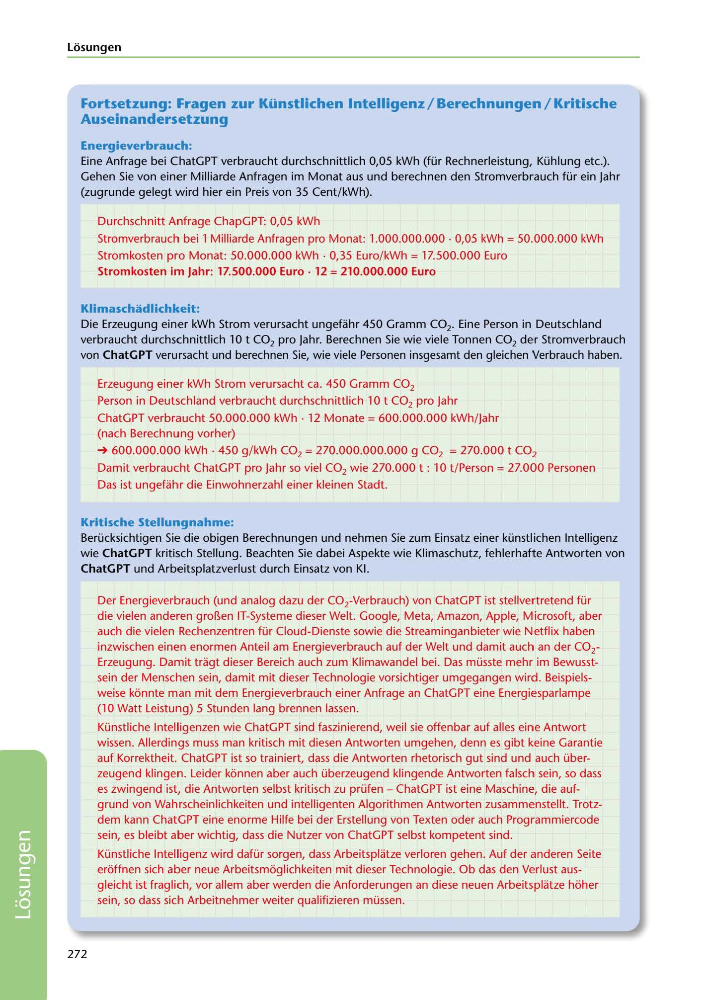

---
## Page 274
---

### Losungen

## Fortsetzung: Fragen zur Künstlichen lntelligenz / Berechnungen / Kritische

### Auseinandersetzung

### Energieverbrauch:

Eine Anfrage bei ChatGPT verbraucht durchschnittlich 0,05 kWh (für Rechnerleistung, Kühlung etc.). Gehen Sie von einer Milliarde Anfragen im Monat aus und berechnen den Stromverbrauch für ein Jahr (zugrunde gelegt wird hier ein Preis von 35 Cent/kWh).

Durchschnitt Anfrage ChapGPT: 0,05 kWh

### Stromkosten im Jahr: 17.500.000 Euro• 12 = 210.000.000 Euro

Stromverbrauch bei 1 Milliarde Anfragen pro Monat: 1.000.000.000 • 0,05 kWh = 50.000.000 kWh Stromkosten pro Monat: 50.000.000 kWh • 0,35 Euro/kWh = 17.500.000 Euro

### Klimaschadlichkeit:

Die Erzeugung einer kWh Strom verursacht ungefahr 450 Gramm CO2. Eine Person in Deutschland verbraucht durchschnittlich 10 t CO2 pro Jahr. Berechnen Sie wie viele Tonnen CO2 der Stromverbrauch von ChatGPT veru rsacht und berechnen Sie, wie viele Personen insgesamt den gleichen Verbrauch haben.

Erzeugung einer kWh Strom verursacht ca. 450 Gramm CO2 Person in Deutschland verbraucht durchschnittlich 1 O t CO2 pro Jahr

ChatGPT verbraucht 50.000.000 kWh · 12 Monate = 600.000.000 kWh/Jahr (nach Berechnung vorher)

## ➔ 600.000.000 kWh • 450 g/ kWh CO2 = 270.000.000.000 g CO2 = 270.000 t CO2

Damit verbraucht ChatGPT pro Jahr so viel CO2 wie 270.000 t: 10 t/Person = 27.000 Personen

Das ist ungefahr die Einwohnerzahl einer kleinen Stadt.

### Kritische Stellungnahme:

### ChatGPT und Arbeitsplatzverlust durch Einsatz von KI.

Berücksichtigen Sie die obigen Berechnungen und nehmen Sie zum Einsatz einer künstlichen lntelligenz wie ChatGPT kritisch Stellung. Beachten Sie dabei Aspekte wie Klimaschutz, fehlerhafte Antworten von

Der Energieverbrauch (und analog dazu der COrVerbrauch) von ChatGPT ist stellvertretend für die vielen anderen gro~en IT-Systeme dieser Welt. Google, Meta, Amazon, Apple, Microsoft, aber auch die vielen Rechenzentren für Cloud-Dienste sowie die Streaminganbieter wie Netflix haben inzwischen einen enormen Anteil am Energieverbrauch auf der Welt und damit auch an der COr Erzeugung. Damit tragt dieser Bereich auch zum Klimawandel bei. Das müsste mehr im Bewusst- sein der Menschen sein, damit mit dieser Technologie vorsichtiger umgegangen wird. Beispiels- weise konnte man mit dem Energieverbrauch einer Anfrage an ChatGPT eine Energiesparlampe (1 O Watt Leistung) 5 Stunden lang brennen lassen.

Künstliche lntelligenzen wie ChatGPT sind faszinierend, weil sie offenbar auf alles eine Antwort wissen. Allerdings muss man kritisch mit diesen Antworten umgehen, denn es gibt keine Garantie auf Korrektheit. ChatGPT ist so trainiert, dass die Antworten rhetorisch gut sind und auch über- zeugend klingen. Leider konnen aber auch überzeugend klingende Antworten falsch sein, so dass es zwingend ist, die Antworten selbst kritisch zu prüfen - ChatGPT ist eine Maschine, die auf- grund von Wahrscheinlichkeiten und intelligenten Algorithmen Antworten zusammenstellt. Trotz- dem kann ChatGPT eine enorme Hilfe bei der Erstellung von Texten oder auch Programmiercode sein, es bleibt aber wichtig, dass die Nutzer von ChatGPT selbst kompetent sind.

Künstliche lntelligenz wird dafür sorgen, dass Arbeitsplatze verloren gehen. Auf der anderen Seite eroffnen sich aber neue Arbeitsmoglichkeiten mit dieser Technologie. Ob das den Verlust aus- gleicht ist fraglich, vor allem aber werden die Anforderungen an diese neuen Arbeitsplatze hoher sein, so dass sich Arbeitnehmer weiter qualifizieren müssen.

272

<!-- IMAGE: page-274-img-1.jpeg - TODO: Add description -->
