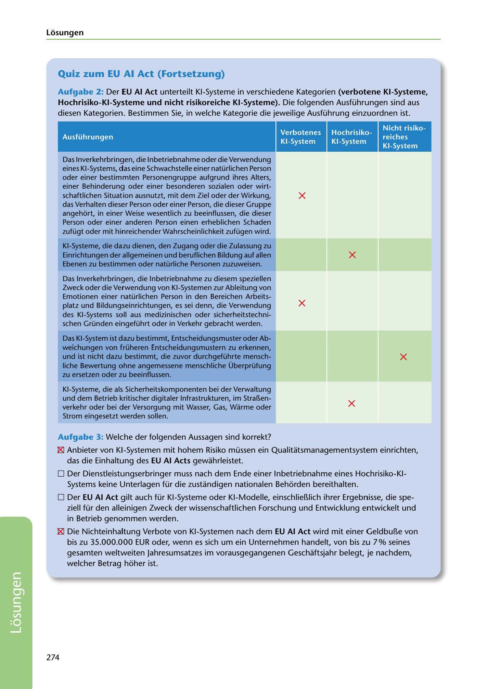

---
## Page 276
---

Losungen

### Quiz zum EU Al Act (Fortsetzung)

Aufgabe 2: Der EU Al Act unterteilt KI-Systeme in verschiedene Kategorien (verbotene KI-Systeme, Hochrisiko-KI-Systeme und nicht risikoreiche KI-Systeme). Die folgenden Ausführungen sind aus diesen Kategorien. Bestimmen Sie, in welche Kategorie die jeweilige Ausführung einzuordnen ist.

Ausführungen

Hochrisiko- KI-System

Nicht risiko- reiches KI-System

# -

X

Das lnverkehrbringen, die lnbetriebnahme oder die Verwendung eines KI-Systems, das eine Schwachstelle einer natürlichen Person oder einer bestimmten Personengruppe aufgrund ihres Alters, einer Behinderung oder einer besonderen sozialen oder wirt- schaftlichen Situation ausnutzt, mit dem Ziel oder der Wirkung, das Verhalten dieser Person oder einer Person, die dieser Gruppe angehort, in einer Weise wesentlich zu beeinflussen, die dieser Person oder einer anderen Person einen erheblichen Schaden zufügt oder mit hinreichender Wahrscheinlichkeit zufügen wird.

X

KI-Systeme, die dazu dienen, den Zugang oder die Zulassung zu Einrichtungen der allgemeinen und beruflichen Bildung auf allen Ebenen zu bestimmen oder natürliche Personen zuzuweisen.

X

Das lnverkehrbringen, die lnbetriebnahme zu diesem speziellen Zweck oder die Verwendung von KI-Systemen zur Ableitung von Emotionen einer natürlichen Person in den Bereichen Arbeits- platz und Bildungseinrichtungen, es sei denn, die Verwendung des KI-Systems soll aus medizinischen oder sicherheitstechni- schen Gründen eingeführt oder in Verkehr gebracht werden.

X

Das KI-System ist dazu bestimmt, Entscheidungsmuster oder Ab- weichungen von früheren Entscheidungsmustern zu erkennen, und ist nicht dazu bestimmt, die zuvor durchgeführte mensch- liche Bewertung ohne angemessene menschliche Überprüfung zu ersetzen oder zu beeinflussen.

X

KI-Systeme, die als Sicherheitskomponenten bei der Verwaltung und dem Betrieb kritischer digitaler lnfrastrukturen, im Stra~en- verkehr oder bei der Versorgung mit Wasser, Gas, Warme oder Strom eingesetzt werden sollen.

### Aufgabe 3: Welche der folgenden Aussagen sind korrekt?

~ Anbieter von KI-Systemen mit hohem Risiko müssen ein Qualitatsmanagementsystem einrichten,

### das die Einhaltung des EU Al Acts gewahrleistet.

□ Der Dienstleistungserbringer muss nach dem Ende einer lnbetriebnahme eines Hochrisiko-KI- Systems keine Unterlagen für die zustandigen nationalen Behorden bereithalten.

□ Der EU Al Act gilt auch für KI-Systeme oder KI-Modelle, einschlie~lich ihrer Ergebnisse, die spe-

ziell für den alleinigen Zweck der wissenschaftlichen Forschung und Entwicklung entwickelt und in Betrieb genommen werden.

gJ Die Nichteinhaltung Verbote von KI-Systemen nach dem EU Al Act wird mit einer Geldbu~e von

bis zu 35.000.000 EUR oder, wenn es sich um ein Unternehmen handelt, von bis zu 7% seines gesamten weltweiten Jahresumsatzes im vorausgegangenen Geschaftsjahr belegt, je nachdem, welcher Betrag hoher ist.

274

<!-- IMAGE: page-276-img-1.jpeg - TODO: Add description -->
