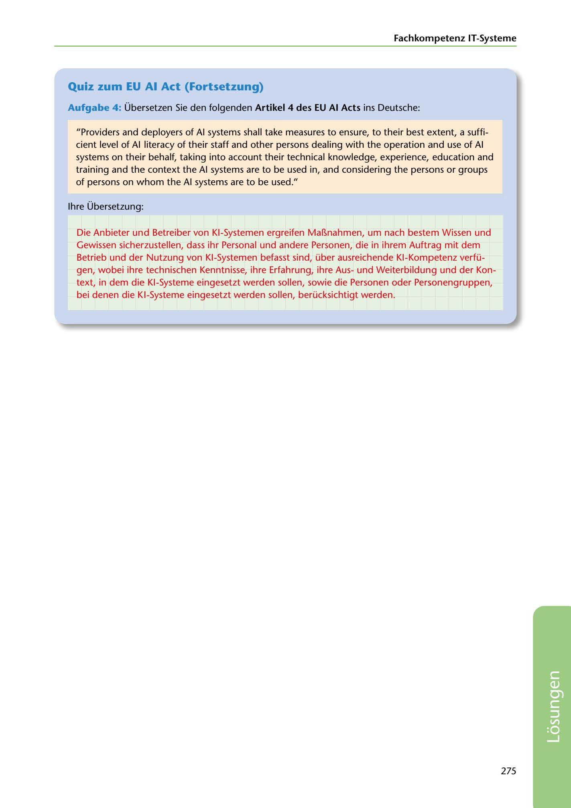

---
## Page 277
---

### Fachkompetenz IT-Systerne

### Quiz zum EU Al Act (Fortsetzung)

Aufgabe 4: Übersetzen Sie den folgenden Artikel 4 des EU Al Acts ins Deutsche:

"Providers and deployers of Al systems shall take measures to ensure, to their best extent, a suffi- cient level of Al literacy of their staff and other persons dealing with the operation and use of Al systems on theiir behalf, taking into account their technical knowledge, experience, education and training and the context the Al systems are to be used in, and considering the persons or groups of persons on whom the Al systems are to be used."

lhre Übersetzung:

Die Anbieter und Betreiber von KI-Systemen ergreifen Ma~nahmen, um nach bestem Wissen und Gewissen sicherzustellen, dass ihr Personal und andere Personen, die in ihrem Auftrag mit dem Betrieb und der Nutzung von KI-Systemen befasst sind, über ausreichende KI-Kompetenz verfü- gen, wobei ihre technischen Kenntnisse, ihre Erfahrung, ihre Ausund Weiterbildung und der Kon- text, in dem die KI-Systeme eingesetzt werden sallen, sowie die Personen oder Personengruppen, bei denen die KI-Systeme eingesetzt werden sallen, berücksichtigt werden.

275

<!-- IMAGE: page-277-img-1.jpeg - TODO: Add description -->
