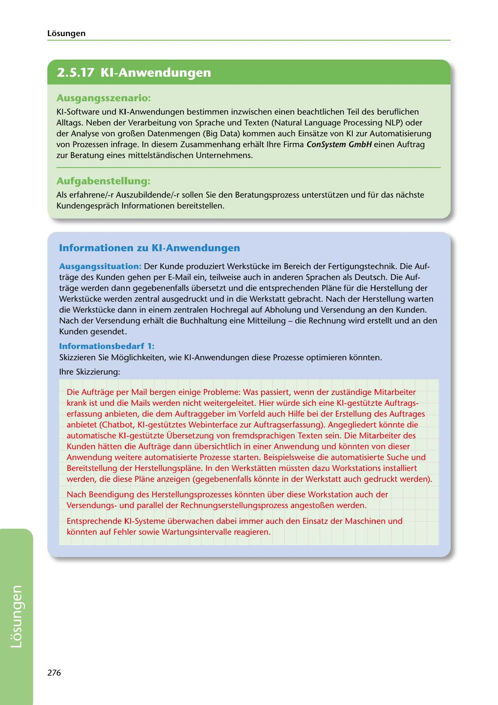

---
## Page 278
---

Losungen

<!-- IMAGE: page-278-img-1.jpeg - TODO: Add description -->

### Ausgangsszenario:

KI-Software und KI-Anwendungen bestimmen inzwischen einen beachtlichen Teil des beruflichen Alltags. Neben der Verarbeitung von Sprache und Texten (Natural Language Processing NLP) oder der Analyse von gro~en Datenmengen (Big Data) kommen auch Einsatze von KI zur Automatisierung von Prozessen infrage. In diesem Zusammenhang erhalt lhre Firma ConSystem GmbH einen Auftrag zur Beratung eines mittelstandischen Unternehmens.

### Aufgabenstellung:

Als erfahrene/-r Auszubildende/-r sallen Sie den Beratungsprozess unterstützen und für das nachste

Kundengesprach l11formationen bereitstellen.

### lnformationen zu KI-Anwendungen

Ausgangssituation: Der Kunde produziert Werkstücke im Bereich der Fertigungstechnik. Die Auf- trage des Kunden gehen per E-Mail ein, teilweise auch in anderen Sprachen als Deutsch. Die Auf- trage werden dann gegebenenfalls übersetzt und die entsprechenden Plane für die Herstellung der Werkstücke werden zentral ausgedruckt und in die Werkstatt gebracht. Nach der Herstellung warten die Werkstücke dann in einem zentralen Hochregal auf Abholung und Versendung an den Kunden. Nach der Versendung erhalt die Buchhaltung eine Mitteilung - die Rechnung wird erstellt und anden Kunden gesendet.

### lnformationsbedañ 1:

Skizzieren Sie Moglichkeiten, wie KI-Anwendungen diese Prozesse optimieren konnten.

lhre Skizzierung:

Die Auftrage per Mail bergen einige Probleme: Was passiert, wenn der zustandige Mitarbeiter krank ist und die Mails werden nicht weitergeleitet. Hier würde sich eine Kl-gestützte Auftrags- erfassung anbieten, die dem Auftraggeber im Vorfeld auch Hilfe bei der Erstellung des Auftrages anbietet (Chatbot, Kl-gestütztes Webinterface zur Auftragserfassung). Angegliedert konnte die automatische Kl-gestützte Übersetzung von fremdsprachigen Texten sein. Die Mitarbeiter des Kunden hatten die Auftrage dann übersichtlich in einer Anwendung und konnten von dieser Anwendung weitere automatisierte Prozesse starten. Beispielsweise die automatisierte Suche und Bereitstellung der Herstellungsplane. In den Werkstatten müssten dazu Workstations installiert werden, die diese Plane anzeigen (gegebenenfalls konnte in der Werkstatt auch gedruckt werden).

Nach Beendigung des Herstellungsprozesses konnten über diese Workstation auch der Versendungsund parallel der Rechnungserstellungsprozess angesto~en werden.

Entsprechende KI-Systeme überwachen dabei immer auch den Einsatz der Maschinen und konnten auf Fehler sowie Wartungsintervalle reagieren.

276

**[VISUAL: CONSYSTEM GMBH SOLUTION HEADER]**
Header image for the ConSystem GmbH AI applications and process automation solutions section.
