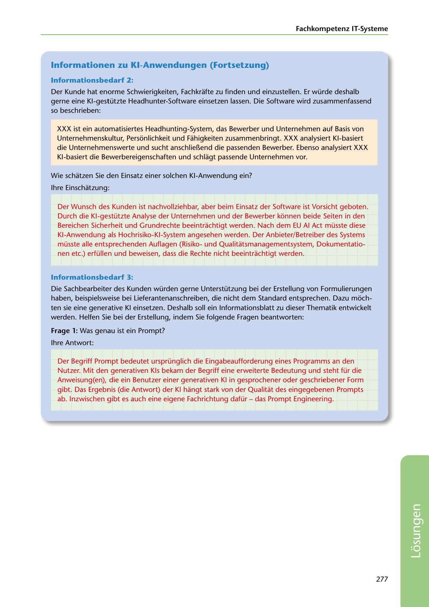

---
## Page 279
---

Fachkompetenz IT-Systerne

### lnformationen zu KI-Anwendungen (Fortsetzung)

### lnformationsbedarf 2:

Der Kunde hat enorme Schwierigkeiten, Fachkrafte zu finden und einzustellen. Er würde deshalb gerne eine Kl-gestützte Headhunter-Software einsetzen lassen. Die Software wird zusammenfassend so beschrieben:

XXX ist ein automatisiertes Headhunting-System, das Bewerber und Unternehmen auf Basis von Unternehmenskultur, Personlichkeit und Fahigkeiten zusammenbringt. XXX analysiert Kl-basiert die Unternehmenswerte und sucht anschlie~end die passenden Bewerber. Ebenso analysiert XXX Kl-basiert die Bewerbereigenschaften und schlagt passende Unternehmen vor.

Wie schatzen Sie den Einsatz einer solchen KI-Anwendung ein?

lhre Einschatzung:

Der Wunsch des Kunden ist nachvollziehbar, aber beim Einsatz der Software ist Vorsicht geboten. Durch die Kl-gestützte Analyse der Unternehmen und der Bewerber konnen beide Seiten in den Bereichen Sicherheit und Grundrechte beeintrachtigt werden. Nach dem EU Al Act müsste diese KI-Anwendung als Hochrisiko-KI-System angesehen werden. Der Anbieter/Betreiber des Systems müsste alle entsprechenden Auflagen (Risikound Qualitatsmanagementsystem, Dokumentatio- nen etc.) erfüllen und beweisen, dass die Rechte nicht beeintrachtigt werden.

### lnformationsbedañ 3:

Die Sachbearbeiter des Kunden würden gerne Unterstützung bei der Erstellung von Formulierungen haben, beispielsweise bei Lieferantenanschreiben, die nicht dem Standard entsprechen. Dazu moch- ten sie eine generative KI einsetzen. Deshalb soll ein lnformationsblatt zu dieser Thematik entwickelt werden. Helfen Sie bei der Erstellung, indem Sie folgende Fragen beantworten:

### Frage 1: Was genau ist ein Prompt?

lhre Antwort:

Der Begriff Prompt bedeutet ursprünglich die Eingabeaufforderung eines Programms an den Nutzer. Mit den generativen Kls bekam der Begriff eine erweiterte Bedeutung und steht für die Anweisung(en), die ein Benutzer einer generativen KI in gesprochener oder geschriebener Form gibt. Das Ergebnis (die Antwort) der KI hangt stark von der Qualitat des eingegebenen Prompts ab. lnzwischen gibt es auch eine eigene Fachrichtung dafür - das Prompt Engineering.

277

<!-- IMAGE: page-279-img-1.jpeg - TODO: Add description -->
