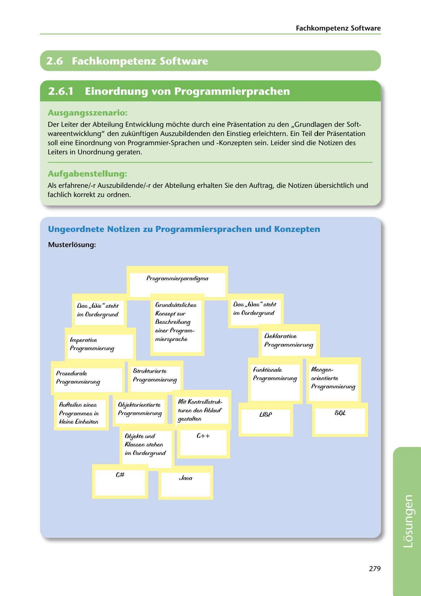

---
## Page 281
---

### Fachkompetenz Software

# 2.6 Fachkompetenz Software

<!-- IMAGE: page-281-img-1.jpeg - TODO: Add description -->

**[VISUAL: PROGRAMMING PARADIGMS HIERARCHY DIAGRAM - SOLUTION]**
A completed hierarchical diagram organizing programming paradigms: Main division between "Das Was" (declarative - focusing on what) and "Das Wie" (imperative - focusing on how). Declarative branch includes funktionale Programmierung (LISP) and mengenorientierte Programmierung (SQL). Imperative branch includes strukturierte Programmierung, prozedurale Programmierung, and objektorientierte Programmierung (C++, C#, Java) with focus on objects and classes.

### Ausgangsszenario:

Der Leiter der Abteilung Entwicklung mochte durch eine Prasentation zu den ,,Grundlagen der Soft- wareentwicklung" den zukünftigen Auszubildenden den Einstieg erleichtern. Ein Teil der Prasentation soll eine Einordnung von Programmier-Sprachen und -Konzepten sein. Leider sind die Notizen des Leiters in Unordnung geraten.

### Aufgabenstellung:

Als erfahrene/-r Auszubildende/-r der Abteilung erhalten Sie den Auftrag, die Notizen übersichtlich und fachlich korrekt zu ordnen.

### Ungeordnete Notizen zu Programmiersprachen und Konzepten

### Musterlosung:

Programmierparadigma

Das .,Mas" srehr

Grundsafzfiches

Das .,Mie "sfehr

im Oordergrund

Konzepr zur

im Oordergrund

8eschrei6un9

einer Program-

Defdarafiue

miersprache

lmperafive

Programmierung

Programmierung

funl<rionafe

S rrul<rurierfe

Prozedurafe

ftlengen- orienfierfe

Pro9rammierun9

Programmierung

Programmierung

Programmierung

ftlir Konfroffsrruk-

fiufteifen eines

Dlyel<rorienfierfe

furen den fibfauf

Programmes in

8()l

Pro9rammierun9

LISP

gesrafren

ldeine [inheifen

Dfyekfe und

G++

Klassen srehen

im Oordergrund

C#

Java

279

**[VISUAL: PROGRAMMING PARADIGMS HIERARCHY DIAGRAM - SOLUTION]**
A completed hierarchical diagram organizing programming paradigms: Main division between "Das Was" (declarative - focusing on what) and "Das Wie" (imperative - focusing on how). Declarative branch includes funktionale Programmierung (LISP) and mengenorientierte Programmierung (SQL). Imperative branch includes strukturierte Programmierung, prozedurale Programmierung, and objektorientierte Programmierung (C++, C#, Java) with focus on objects and classes.
