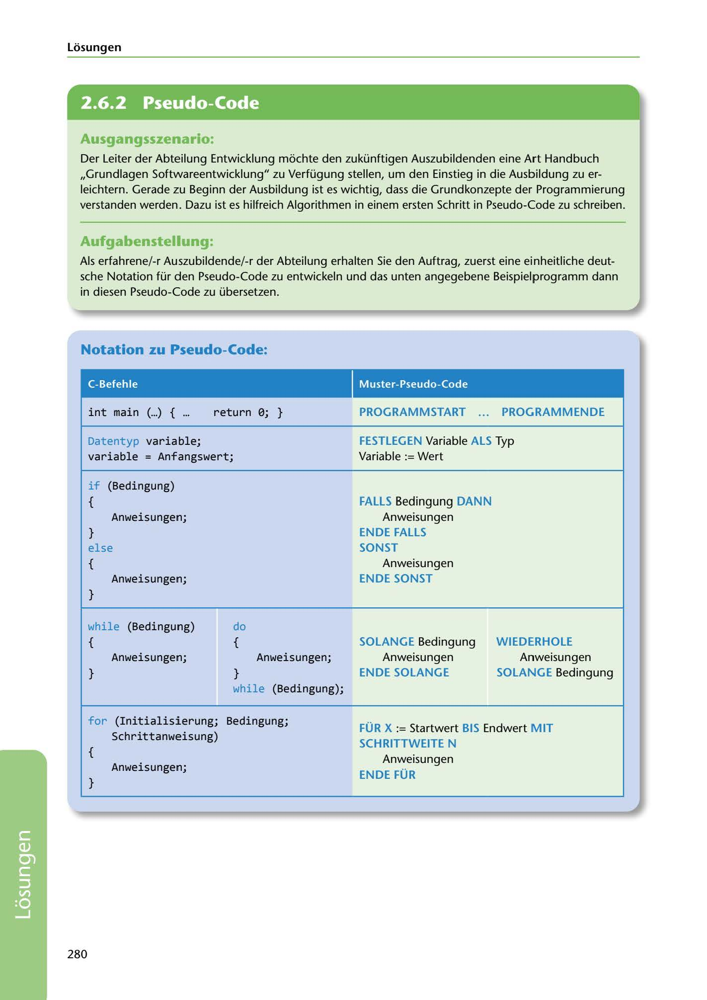

---
## Page 282
---

Losungen

<!-- IMAGE: page-282-img-1.jpeg - TODO: Add description -->

**[VISUAL: PSEUDO-CODE NOTATION REFERENCE TABLE - SOLUTION]**
A complete reference table showing C programming language constructs mapped to German pseudo-code notation. Includes translations for: main function (PROGRAMMSTART/PROGRAMMENDE), variable declarations (FESTLEGEN), if-else statements (FALLS/DANN/SONST), while loops (SOLANGE), do-while loops (WIEDERHOLE/SOLANGE), and for loops (FÜR/BIS/MIT SCHRITTWEITE).

## Ausgangsszenario:

Der Leiter der Abteilung Entwicklung mochte den zukünftigen Auszubildenden eine Art Handbuch ,,Grundlagen Softwareentwicklung" zu Verfügung stellen, um den Einstieg in die Ausbildung zu er- leichtern. Gerade zu Beginn der Ausbildung ist es wichtig, dass die Grundkonzepte der Programmierung verstanden werden. Dazu ist es hilfreich Algorithmen in einem ersten Schritt in Pseudo-Code zu schreiben.

## Aufgabenstellung:

Als erfahrene/-r Auszubildende/-r der Abteilung erhalten Sie den Auftrag, zuerst eine einheitliche deut- sche Notation für den Pseudo-Code zu entwickeln und das unten angegebene Beispielprogramm dann in diesen Pseudo-Code zu übersetzen.

## Notation zu Pseudo-Code:

C-Befehle Muster-Pseudo-Code

### PROGRAMMSTART ...

### PROGRAMMENDE

## int main ( ... ) { ...

return 0; }

### FESTLEGEN Variable ALS Typ

Variable := Wert

Datentyp variable; variable= Anfangswert;

### FALLS Bedingung DANN

### ENDE FALLS

### SONST

Anweisungen

### ENDE SONST

Anweisungen

## if (Bedingung)

{ Anweisungen; } else { Anweisungen; }

11 do

### WIEDERHOLE

### SOLANGE Bedingung

### ENDE SOLANGE

Anweisungen

### SOLANGE Bedingung

Anweisungen

while (Bedingung) { Anweisungen; }

{ Anweisungen; } while (Bedingung);

for (Initialisierung; Bedingung;

### FÜR X := Startwert BIS Endwert MIT

### SCHRITTWEITE N

### ENDE FÜR

Anweisungen

Schrittanweisung) { Anweisungen; }

**[VISUAL: PSEUDO-CODE NOTATION REFERENCE TABLE - SOLUTION]**
A complete reference table showing C programming language constructs mapped to German pseudo-code notation. Includes translations for: main function (PROGRAMMSTART/PROGRAMMENDE), variable declarations (FESTLEGEN), if-else statements (FALLS/DANN/SONST), while loops (SOLANGE), do-while loops (WIEDERHOLE/SOLANGE), and for loops (FÜR/BIS/MIT SCHRITTWEITE).

280

**[VISUAL: PSEUDO-CODE NOTATION REFERENCE TABLE - SOLUTION]**
A complete reference table showing C programming language constructs mapped to German pseudo-code notation. Includes translations for: main function (PROGRAMMSTART/PROGRAMMENDE), variable declarations (FESTLEGEN), if-else statements (FALLS/DANN/SONST), while loops (SOLANGE), do-while loops (WIEDERHOLE/SOLANGE), and for loops (FÜR/BIS/MIT SCHRITTWEITE).
