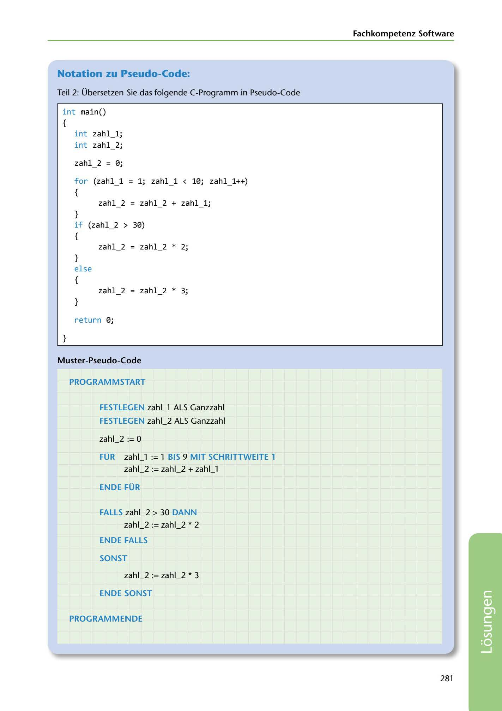

---
## Page 283
---

Fachkompetenz Softwa re

### Notation zu Pseudo-Code:

Teil 2: Übersetzen Sie das folgende C-Programm in Pseudo-Code

## int main()

{

## int zahl_l;

## int zahl_2;

## zahl_2 = 0;

## for (zahl_l = 1; zahl_l < 10; zahl_l++)

{

## zahl_2 = zahl_2 + zahl_l ;

## if (zahl_2 > 30)

} {

## zahl 2 = zahl 2 * 2;

- } else {

## zahl_2 = zahl_2 * 3;

}

return 0;

}

### Muster-Pseudo-Code

### PROGRAMMSTART

### FESTLEGEN zahl_l ALS Ganzzahl

### FESTLEGEN zahl_2 ALS Ganzzahl

zahl_2 := O

### FÜR zahl_l := 1 BIS 9 MIT SCHRITTWEITE 1

zahl_2 := zahl_2 + zahl_l

### ENDEFÜR

### FALLS zahl 2 > 30 DANN

zahl_2 := zahl_2 * 2

### ENDE FALLS

### SONST

zahl 2 := zahl_2 * 3

### ENDE SONST

### PROGRAMMENDE

281

<!-- IMAGE: page-283-img-1.jpeg - TODO: Add description -->
