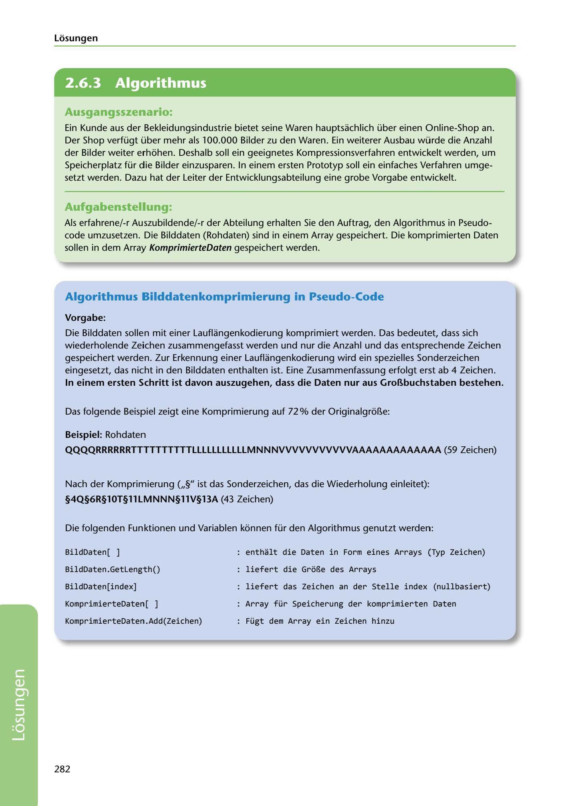

---
## Page 284
---

Losungen

<!-- IMAGE: page-284-img-1.jpeg - TODO: Add description -->

**[VISUAL: CONSYSTEM GMBH SOLUTION HEADER]**
Header image for the ConSystem GmbH image compression algorithm pseudo-code solutions section.

### Ausgangsszenario:

Ein Kunde aus der Bekleidungsindustrie bietet seine Waren hauptsachlich über einen Online-Shap an. Der Shap verfügt über mehr als 100.000 Bilder zu den Waren. Ein weiterer Ausbau würde die Anzahl der Bilder weiter erhohen. Deshalb sall ein geeignetes Kampressiansverfahren entwickelt werden, um Speicherplatz für die Bilder einzusparen. In einem ersten Protatyp sall ein einfaches Verfahren umge- setzt werden. Dazu hat der Leiter der Entwicklungsabteilung eine grabe Vargabe entwickelt.

### Aufgabenstellung:

Als erfahrene/-r Auszubildende/-r der Abteilung erhalten Sie den Auftrag, den Algarithmus in Pseuda- code umzusetzen. Die Bilddaten (Rahdaten) sind in einem Array gespeichert. Die kamprimierten Daten sallen in dem Array KomprimierteDaten gespeichert werden.

### Algorithmus Bilddatenkomprimierung in Pseudo-Code

### Vorgabe:

Die Bilddaten sallen mit einer Lauflangenkadierung kamprimiert werden. Das bedeutet, dass sich wiederhalende Zeichen zusammengefasst werden und nur die Anzahl und das entsprechende Zeichen gespeichert werden. Zur Erkennung einer Lauflangenkadierung wird ein spezielles Sanderzeichen eingesetzt, das nicht in den Bilddaten enthalten ist. Eine Zusammenfassung erfolgt erst ab 4 Zeichen. In einem ersten Schritt ist davon auszugehen, dass die Daten nur aus GroBbuchstaben bestehen.

Das folgende Beispiel zeigt eine Kamprimierung auf 72% der OriginalgroBe:

### Beispiel: Rahdaten

QQQQRRRRRRTTTTTTTTTTLLLLLLLLLLLMNNNVVVVVVVVVVVAAAAAAAAAAAAA (59 Zeichen)

Nach der Kamprimierung (,,§" ist das Sanderzeichen, das die Wiederhalung einleitet):

### §4Q§6R§lOT§llLMNNN§llV§BA (43 Zeichen)

Die folgenden Fun ktianen und Varia bien konnen für den Algarithmus genutzt werden:

BildDaten [ ]

enthalt die Daten in Form eines Arrays (Typ Zeichen)

BildDaten.Getlength()

liefert die GroBe des Arrays

BildDaten[index]

liefert das Zeichen an der Stelle index (nullbasiert)

KomprimierteDaten[

Array für Speicherung der komprimierten Daten

KomprimierteDaten.Add(Zeichen)

Fügt dem Array ein Zeichen hinzu

282

**[VISUAL: CONSYSTEM GMBH SOLUTION HEADER]**
Header image for the ConSystem GmbH image compression algorithm pseudo-code solutions section.
