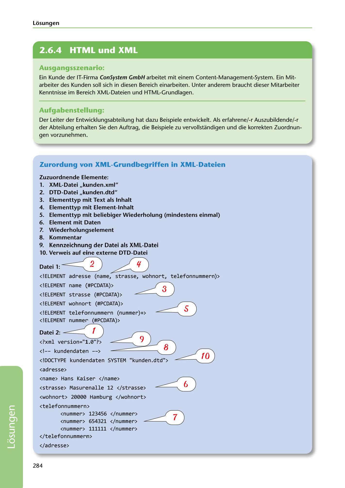

---
## Page 286
---

Losungen

<!-- IMAGE: page-286-img-1.jpeg - TODO: Add description -->

### Ausgangsszenario:

Ein Kunde der IT-Firma ConSystem GmbH arbeitet mit einem Content-Management-System. Ein Mit- arbeiter des Kunden soll sich in diesen Bereich einarbeiten. Unter anderem braucht dieser Mitarbeiter Kenntnisse im Bereich XML-Dateien und HTML-Grundlagen.

### Aufgabenstellung:

Der Leiter der Entwicklungsabteilung hat dazu Beispiele entwickelt. Als erfahrene/-r Auszubildende/-r der Abteilung erhalten Sie den Auftrag, die Beispiele zu vervollstandigen und die korrekten Zuordnun- gen vorzunehmen.

### Zurordung von XML-Grundbegriffen in XML-Dateien

### Zuzuordnende Elemente:

### l. XML-Datei ,,kunden.xml"

### 2. DTD-Datei ,,kunden.dtd"

### 3. Elementtyp mit Text als lnhalt

### 4. Elementtyp mit Element-lnhalt

### 6. Element mit Daten

### 7. Wiederholungselement

### 8. Kommentar

### 9. Kennzeichnung der Datei als XML-Datei

5. Elementtyp mit beliebiger Wiederholung (mindestens einmal)

### 10. Verweis auf eine externe DTD-Datei

### Dateil: ~

# ~

<!ELEMENT adresse (name, strasse, wohnort, telefonnummern)>

<!ELEMENT name (#PCDATA)>

<!ELEMENT strasse (#PCDATA)>

<!ELEMENT wohnort (#PCDATA)>

**[VISUAL: XML AND DTD FILE STRUCTURE DIAGRAM - SOLUTION]**
Annotated XML code examples showing numbered references (1-10) pointing to: XML file identification, DTD file reference, element types with text content (#PCDATA), element types with child elements, repetition indicators (+), comments, XML declaration, external DTD reference, and data elements. Shows both DTD structure (kunden.dtd) and corresponding XML instance (kunden.xml) with address data.

<!ELEMENT telefonnummern (nummer)+> < ! ELEMENT nummer (#PCDATA)>

### Datei2: ~

<?xml version="l.0"?>

**[VISUAL: XML AND DTD FILE STRUCTURE DIAGRAM - SOLUTION]**
Annotated XML code examples showing numbered references (1-10) pointing to: XML file identification, DTD file reference, element types with text content (#PCDATA), element types with child elements, repetition indicators (+), comments, XML declaration, external DTD reference, and data elements. Shows both DTD structure (kunden.dtd) and corresponding XML instance (kunden.xml) with address data.

<adresse>

<name> Hans Kaiser </name>

<strasse> Masurenalle 12 </strasse>

**[VISUAL: XML AND DTD FILE STRUCTURE DIAGRAM - SOLUTION]**
Annotated XML code examples showing numbered references (1-10) pointing to: XML file identification, DTD file reference, element types with text content (#PCDATA), element types with child elements, repetition indicators (+), comments, XML declaration, external DTD reference, and data elements. Shows both DTD structure (kunden.dtd) and corresponding XML instance (kunden.xml) with address data.

<wohnort > 20000 Hamburg </wohnort >

**[VISUAL: XML AND DTD FILE STRUCTURE DIAGRAM - SOLUTION]**
Annotated XML code examples showing numbered references (1-10) pointing to: XML file identification, DTD file reference, element types with text content (#PCDATA), element types with child elements, repetition indicators (+), comments, XML declaration, external DTD reference, and data elements. Shows both DTD structure (kunden.dtd) and corresponding XML instance (kunden.xml) with address data.

<telefonnummern> <nummer> 123456 </nummer> <nummer> 654321 </nummer> <nummer> 111111 </nummer> </telefonnummern>

</adresse>

284

**[VISUAL: XML AND DTD FILE STRUCTURE DIAGRAM - SOLUTION]**
Annotated XML code examples showing numbered references (1-10) pointing to: XML file identification, DTD file reference, element types with text content (#PCDATA), element types with child elements, repetition indicators (+), comments, XML declaration, external DTD reference, and data elements. Shows both DTD structure (kunden.dtd) and corresponding XML instance (kunden.xml) with address data.
