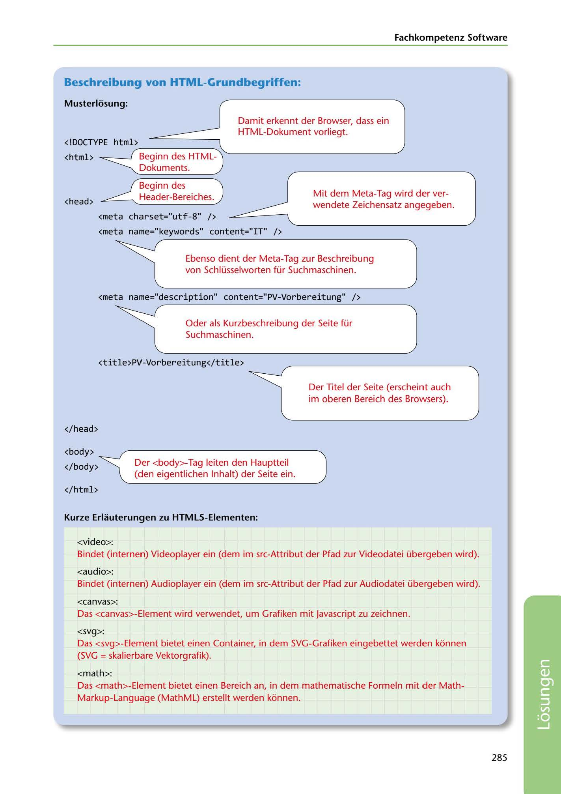

---
## Page 287
---

### Fachkompetenz Software

### Beschreibung von HTML-Grundbegriffen:

### Musterlosung:

<!-- IMAGE: page-287-img-1.jpeg - TODO: Add description -->

# <!D0CTYPE html> - -------

## <html> ~-_, Beginn des HTML-

Damit erkennt der Browser, dass ein HTML-Dokument vorliegt.

Dokuments.

Beginn des -ce.----- Header-Bereiches.

<head>

Mit dem Meta-Tag wird der ver- wendete Zeichensatz angegeben.

**[VISUAL: HTML5 DOCUMENT STRUCTURE DIAGRAM - SOLUTION]**
Annotated HTML5 code example with arrows pointing to explanations for each element: DOCTYPE declaration (browser identification), html tag (document start), head section with meta tags (charset=utf-8 for character encoding, keywords and description for search engines), title element (browser title bar), and body section (main content area).

<meta charset="utf-8" />

<meta name="keywords" content="IT" />

**[VISUAL: HTML5 DOCUMENT STRUCTURE DIAGRAM - SOLUTION]**
Annotated HTML5 code example with arrows pointing to explanations for each element: DOCTYPE declaration (browser identification), html tag (document start), head section with meta tags (charset=utf-8 for character encoding, keywords and description for search engines), title element (browser title bar), and body section (main content area).

Ebenso dient der Meta-Tag zur Beschreibung von Schlüsselworten für Suchmaschinen.

<meta name="description" content ="PV-Vorbereitung" />

**[VISUAL: HTML5 DOCUMENT STRUCTURE DIAGRAM - SOLUTION]**
Annotated HTML5 code example with arrows pointing to explanations for each element: DOCTYPE declaration (browser identification), html tag (document start), head section with meta tags (charset=utf-8 for character encoding, keywords and description for search engines), title element (browser title bar), and body section (main content area).

Oder als Kurzbeschreibung der Seite für Suchmaschinen.

<title>PV-Vorbereitung</title>

Der Titel der Seite (erscheint auch im oberen Bereich des Browsers).

**[VISUAL: HTML5 DOCUMENT STRUCTURE DIAGRAM - SOLUTION]**
Annotated HTML5 code example with arrows pointing to explanations for each element: DOCTYPE declaration (browser identification), html tag (document start), head section with meta tags (charset=utf-8 for character encoding, keywords and description for search engines), title element (browser title bar), and body section (main content area).

</head>

<body>

</body>

Der <body>-Tag leiten den Hauptteil (den eigentlichen lnhalt) der Seite ein.

</html>

### Kurze Erlauterungen zu HTMLS-Elementen:

<video>:

Bindet (internen) Videoplayer ein (dem im src-Attribut der Pfad zur Videodatei übergeben wird).

<audio>: Bindet (internen) Audioplayer ein (dem im src-Attribut der Pfad zur Audiodatei übergeben wird).

<canvas>: Das <canvas>-Element wird verwendet, um Grafiken mit Javascript zu zeichnen.

<svg>: Das <svg>-Element bietet einen Container, in dem SVG-Grafiken eingebettet werden kónnen (SVG = skalierbare Vektorgrafik).

<math>: Das <math>-Element bietet einen Bereich an, in dem mathematische Formeln mit der Math- Markup-Language (MathML) erstellt werden kónnen.

285

**[VISUAL: HTML5 DOCUMENT STRUCTURE DIAGRAM - SOLUTION]**
Annotated HTML5 code example with arrows pointing to explanations for each element: DOCTYPE declaration (browser identification), html tag (document start), head section with meta tags (charset=utf-8 for character encoding, keywords and description for search engines), title element (browser title bar), and body section (main content area).
