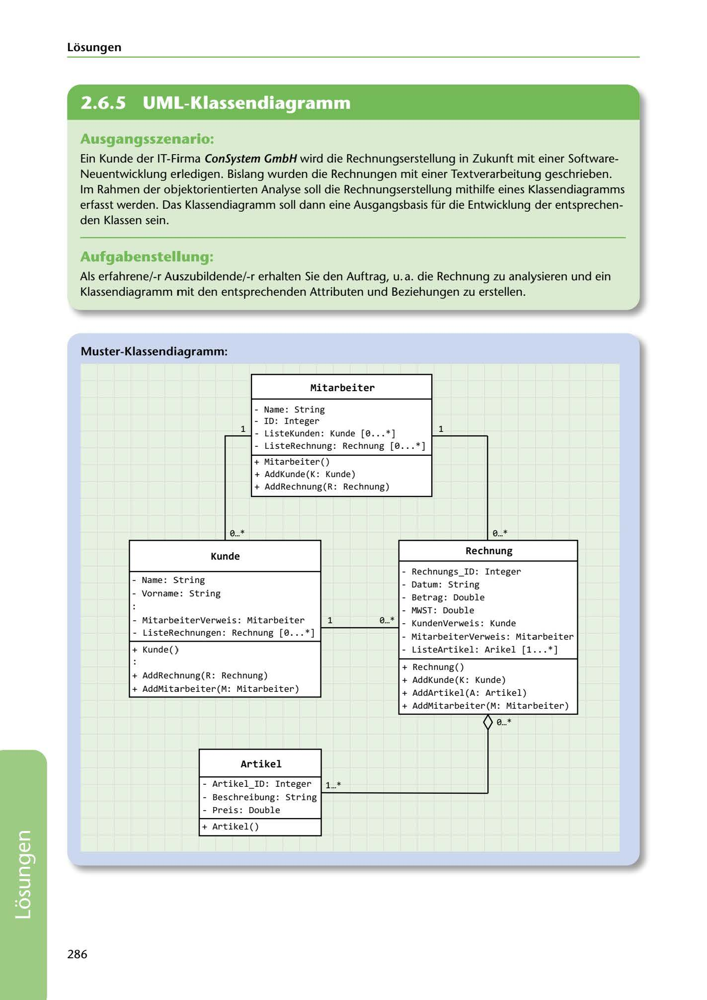

---
## Page 288
---

Losungen

<!-- IMAGE: page-288-img-1.jpeg - TODO: Add description -->

**[VISUAL: UML CLASS DIAGRAM - INVOICE SYSTEM SOLUTION]**
A complete UML class diagram showing the object-oriented design for an invoicing system. Classes include: Mitarbeiter (employee), Kunde (customer), Rechnung (invoice), and Artikel (article/item). Each class shows attributes with data types (String, Integer, Double) and methods. Relationship lines show associations with multiplicities (0..*, 1, 1..*).

## Ausgangsszenario:

Ein Kunde der IT-Firma ConSystem GmbH w ird die Rechnungserstellung in Zukunft mit einer Software- Neuentwicklung erledigen. Bislang wurden die Rechnungen mit einer Textverarbeitung geschrieben. lm Rahmen der objektorientierten Analyse soll die Rechnungserstellung mithilfe eines Klassendiagramms erfasst werden. Das Klassendiagramm soll dann eine Ausgangsbasis für die Entwicklung der entsprechen- den Klassen sein.

## Aufgabenstellung:

Als erfahrene/-r Auszubildende/-r erhalten Sie den Auftrag, u. a. die Rechnung zu analysieren und ein Klassendiagramm mit den entsprechenden Attributen und Beziehungen zu erstellen.

### Muster-Klassendiagramm:

### Mitarbeiter

# -

- Narne: String - ID: Int eger 1 - Li st eKunden : Kunde [ 0 ... * l 1 - Li st eRechnung: Rechnung ¡0 .. . * l

+ Mitarbeiter() + AddKunde(K : Kunde) + AddRechnung( R: Rechnung)

0 ... * 0 ... *

### Kunde

### Rechnung

- Rechnungs_ID: I nt eger - Name: String Datum: String - - Vornarne : St ri ng - Betrag: Doubl e : - MWST : Doubl e - Mit arbeiterVerwei s : Mi t arbeiter 1 0 ... * - KundenVerwei s : Kunde - ListeRechnungen: Rechnung (0 ... *] - Mitarbeiter Verwei s : Mitarbeiter + Kunde() - Li st eArtikel: Ari kel (1. .. * l : + Rechnung() + AddRechnung(R : Rechnung) + AddKunde(K : Kunde) + AddMitarbei ter(M: Mitarbeiter) + AddArtikel (A: Artikel ) + AddMitarbeiter(M: Mitarbei ter)

1 ) 0 ... *

### Artikel

- Artikel - ID: Int eger l... * - Beschrei bung: Stri ng - Preis : Double

+ Artikel()

286

**[VISUAL: UML CLASS DIAGRAM - INVOICE SYSTEM SOLUTION]**
A complete UML class diagram showing the object-oriented design for an invoicing system. Classes include: Mitarbeiter (employee), Kunde (customer), Rechnung (invoice), and Artikel (article/item). Each class shows attributes with data types (String, Integer, Double) and methods. Relationship lines show associations with multiplicities (0..*, 1, 1..*).
