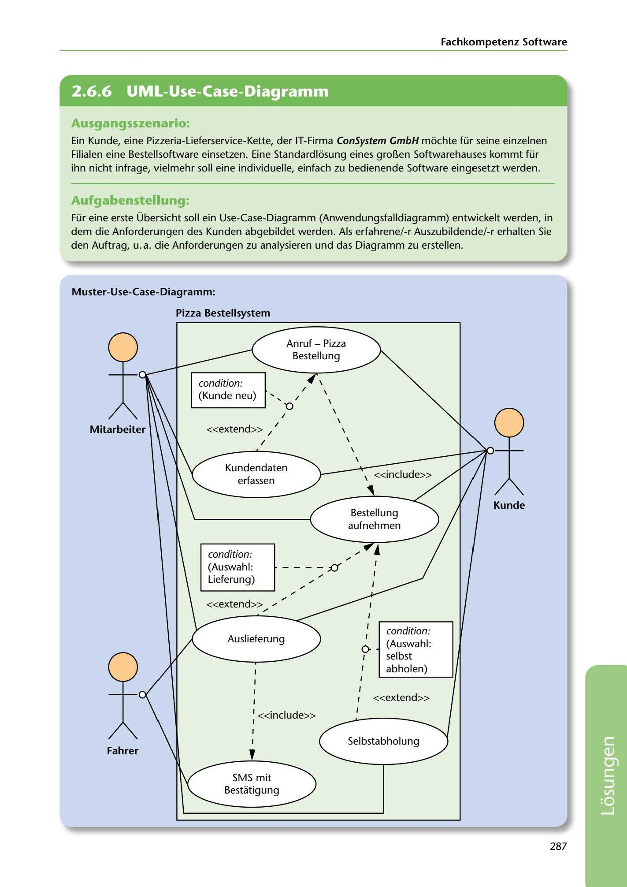

---
## Page 289
---

Fachkompetenz Software

<!-- IMAGE: page-289-img-1.jpeg - TODO: Add description -->

**[VISUAL: UML USE CASE DIAGRAM - PIZZA ORDERING SYSTEM SOLUTION]**
A complete UML use case diagram for a pizza delivery ordering system. Shows system boundary "Pizza Bestellsystem" with actors Kunde (customer) and Fahrer (driver). Use cases include: Anruf (call), Pizza Bestellung (order), Kunde erfassen (capture customer), Lieferung (delivery), selbst abholen (pickup), and SMS notification. Relationships show <<extend>> and <<include>> stereotypes with conditions for new customers, delivery, and pickup options.

## Ausgangsszenario:

Ein Kunde, eine Pizzeria-Lieferservice-Kette, der IT-Firma ConSystem GmbH mochte für seine einzelnen Filialen eine Bestelllsoftware einsetzen. Eine Standardlosung eines gro~en Softwarehauses kommt für ihn nicht infrage, vielmehr soll eine individuelle, einfach zu bedienende Software eingesetzt werden.

## Aufgabenstellung:

Für eine erste Übersicht soll ein Use-Case-Diagramm (Anwendungsfalldiagramm) entwickelt werden, in dem die Anforderungen des Kunden abgebildet werden. Als erfahrene/-r Auszubildende/-r erhalten Sie den Auftrag, u.a. die Anforderungen zu analysieren und das Diagramm zu erstellen.

**[VISUAL: UML USE CASE DIAGRAM - PIZZA ORDERING SYSTEM SOLUTION]**
A complete UML use case diagram for a pizza delivery ordering system. Shows system boundary "Pizza Bestellsystem" with actors Kunde (customer) and Fahrer (driver). Use cases include: Anruf (call), Pizza Bestellung (order), Kunde erfassen (capture customer), Lieferung (delivery), selbst abholen (pickup), and SMS notification. Relationships show <<extend>> and <<include>> stereotypes with conditions for new customers, delivery, and pickup options.

### Muster-Use-Case-Diagramm:

### Pizza Bestellsystem

Anruf - Pizza

Bestellung

/

\ \

\

\

\

condition: (Kunde neu) .... / D / <<extend>> / /

I

**[VISUAL: UML USE CASE DIAGRAM - PIZZA ORDERING SYSTEM SOLUTION]**
A complete UML use case diagram for a pizza delivery ordering system. Shows system boundary "Pizza Bestellsystem" with actors Kunde (customer) and Fahrer (driver). Use cases include: Anruf (call), Pizza Bestellung (order), Kunde erfassen (capture customer), Lieferung (delivery), selbst abholen (pickup), and SMS notification. Relationships show <<extend>> and <<include>> stereotypes with conditions for new customers, delivery, and pickup options.

erfassen

### Kunde

condition: (Auswahl: Lieferung)

**[VISUAL: UML USE CASE DIAGRAM - PIZZA ORDERING SYSTEM SOLUTION]**
A complete UML use case diagram for a pizza delivery ordering system. Shows system boundary "Pizza Bestellsystem" with actors Kunde (customer) and Fahrer (driver). Use cases include: Anruf (call), Pizza Bestellung (order), Kunde erfassen (capture customer), Lieferung (delivery), selbst abholen (pickup), and SMS notification. Relationships show <<extend>> and <<include>> stereotypes with conditions for new customers, delivery, and pickup options.

### <<extend>>

## ,,

,,,, ,,,,

# 0-, ,

condition: (Auswahl: selbst abholen)

# ,

1

# ,

, <<extend>>

1 <<include>> 1

### Fahrer

SMS mit

**[VISUAL: UML USE CASE DIAGRAM - PIZZA ORDERING SYSTEM SOLUTION]**
A complete UML use case diagram for a pizza delivery ordering system. Shows system boundary "Pizza Bestellsystem" with actors Kunde (customer) and Fahrer (driver). Use cases include: Anruf (call), Pizza Bestellung (order), Kunde erfassen (capture customer), Lieferung (delivery), selbst abholen (pickup), and SMS notification. Relationships show <<extend>> and <<include>> stereotypes with conditions for new customers, delivery, and pickup options.

287

**[VISUAL: UML USE CASE DIAGRAM - PIZZA ORDERING SYSTEM SOLUTION]**
A complete UML use case diagram for a pizza delivery ordering system. Shows system boundary "Pizza Bestellsystem" with actors Kunde (customer) and Fahrer (driver). Use cases include: Anruf (call), Pizza Bestellung (order), Kunde erfassen (capture customer), Lieferung (delivery), selbst abholen (pickup), and SMS notification. Relationships show <<extend>> and <<include>> stereotypes with conditions for new customers, delivery, and pickup options.
