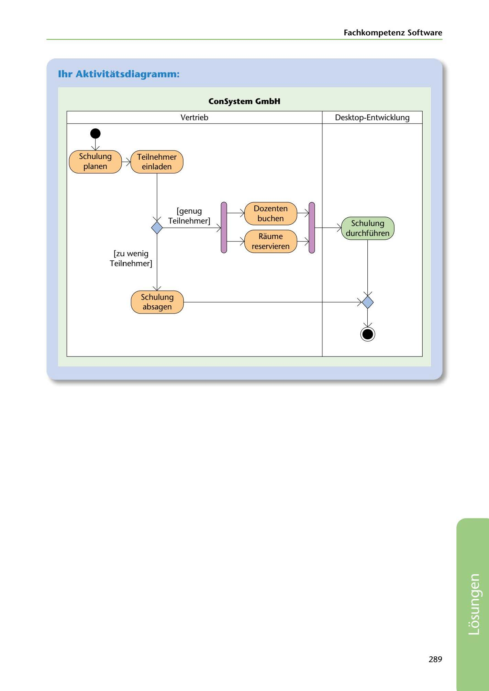

---
## Page 291
---

Fachkompetenz Software

## 1hr Aktivitatsdiagramm:

### ConSystem GmbH

Vertrieb

Desktop-Entwicklu ng

<!-- IMAGE: page-291-img-1.jpeg - TODO: Add description -->

Schulung planen Teilnehmer

einladen

Dozenten buchen

[genug Teilnehmer]

Schulung durchführen

Raume reservieren

**[VISUAL: UML ACTIVITY DIAGRAM - TRAINING SCHEDULING SOLUTION]**
A complete UML activity diagram showing a training scheduling process with swimlanes for Vertrieb (sales) and Desktop-Entwicklung. Activities include: Schulung planen (plan training), Teilnehmer einladen (invite participants), Dozenten buchen (book instructor), Räume reservieren (reserve rooms). Decision diamond with conditions [genug Teilnehmer] leading to Schulung durchführen (conduct training) or [zu wenig Teilnehmer] leading to Schulung absagen (cancel training).

**[VISUAL: UML ACTIVITY DIAGRAM - TRAINING SCHEDULING SOLUTION]**
A complete UML activity diagram showing a training scheduling process with swimlanes for Vertrieb (sales) and Desktop-Entwicklung. Activities include: Schulung planen (plan training), Teilnehmer einladen (invite participants), Dozenten buchen (book instructor), Räume reservieren (reserve rooms). Decision diamond with conditions [genug Teilnehmer] leading to Schulung durchführen (conduct training) or [zu wenig Teilnehmer] leading to Schulung absagen (cancel training).

[zu wenig Teilnehmer]

Schulung absagen

**[VISUAL: UML ACTIVITY DIAGRAM - TRAINING SCHEDULING SOLUTION]**
A complete UML activity diagram showing a training scheduling process with swimlanes for Vertrieb (sales) and Desktop-Entwicklung. Activities include: Schulung planen (plan training), Teilnehmer einladen (invite participants), Dozenten buchen (book instructor), Räume reservieren (reserve rooms). Decision diamond with conditions [genug Teilnehmer] leading to Schulung durchführen (conduct training) or [zu wenig Teilnehmer] leading to Schulung absagen (cancel training).

289

**[VISUAL: UML ACTIVITY DIAGRAM - TRAINING SCHEDULING SOLUTION]**
A complete UML activity diagram showing a training scheduling process with swimlanes for Vertrieb (sales) and Desktop-Entwicklung. Activities include: Schulung planen (plan training), Teilnehmer einladen (invite participants), Dozenten buchen (book instructor), Räume reservieren (reserve rooms). Decision diamond with conditions [genug Teilnehmer] leading to Schulung durchführen (conduct training) or [zu wenig Teilnehmer] leading to Schulung absagen (cancel training).
