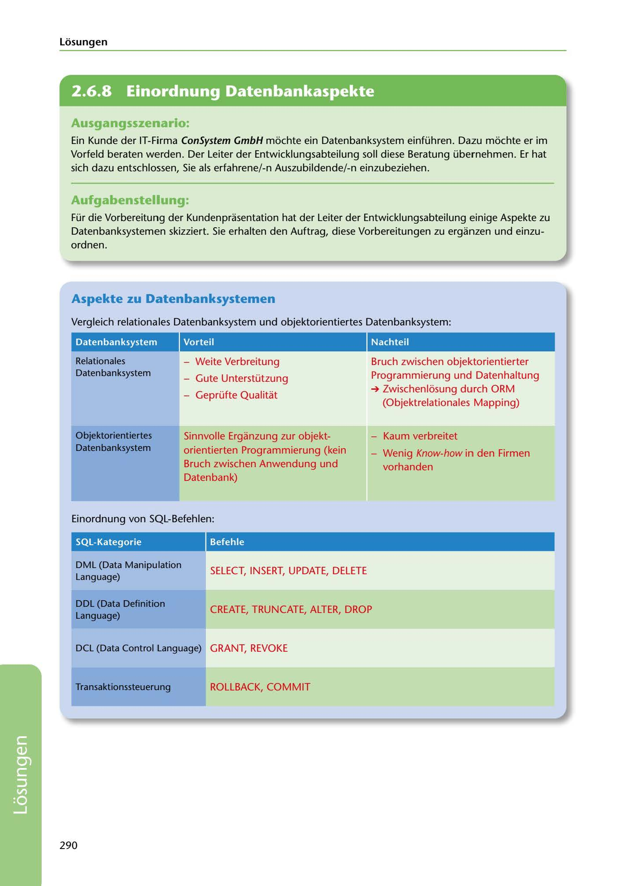

---
## Page 292
---

Losungen

<!-- IMAGE: page-292-img-1.jpeg - TODO: Add description -->

**[VISUAL: CONSYSTEM GMBH SOLUTION HEADER]**
Header image for the ConSystem GmbH database systems solutions section.

## Ausgangsszenario:

Ein Kunde der IT-Firma ConSystem GmbH mochte ein Datenbanksystem einführen. Dazu mochte er im Vorfeld beraten werden. Der Leiter der Entwicklungsabteilung soll diese Beratung übernehmen. Er hat sich dazu entschlossen, Sie als erfahrene/-n Auszubildende/-n einzubeziehen.

## Aufgabenstellung:

Für die Vorbereitung der Kundenprasentation hat der Leiter der Entwicklungsabteilung einige Aspekte zu Datenbanksystemen skizziert. Sie erhalten den Auftrag, diese Vorbereitungen zu erganzen und einzu- ordnen.

## Aspekte zu Datenbanksystemen

Vergleich relationales Datenbanksystem und objektorientiertes Datenbanksystem:

### Vorteil

### Nachteil

Datenban ksystem

- Weite Verbreitung

### Relationales

### Datenbanksystem

Bruch zwischen objektorientierter Programmierung und Datenhaltung

- Gute Unterstützung

- Geprüfte Qualitat

➔ Zwischenlosung durch ORM (Objektrelationales Mapping)

- Kaum verbreitet

### Objektorientiertes

### Datenbanksystem

- Wenig Know-how in den Firmen vorhanden

Sinnvolle Erganzung zur objekt- orientierten Programmierung (kein Bruch zwischen Anwendung und Datenbank)

Einordnung von SQL-Befehlen:

### SQL-Kategorie

### Befehle

SELECT, INSERT, UPDATE, DELETE

### DM L (Data Manipulation

### Language)

### DDL (Data Definition

### Language)

CREATE, TRUNCATE, ALTER, DROP

DCL (Data Control Language) GRANT, REVOKE

### Transaktionssteuerung

ROLLBACK, COMMIT

290

**[VISUAL: CONSYSTEM GMBH SOLUTION HEADER]**
Header image for the ConSystem GmbH database systems solutions section.
