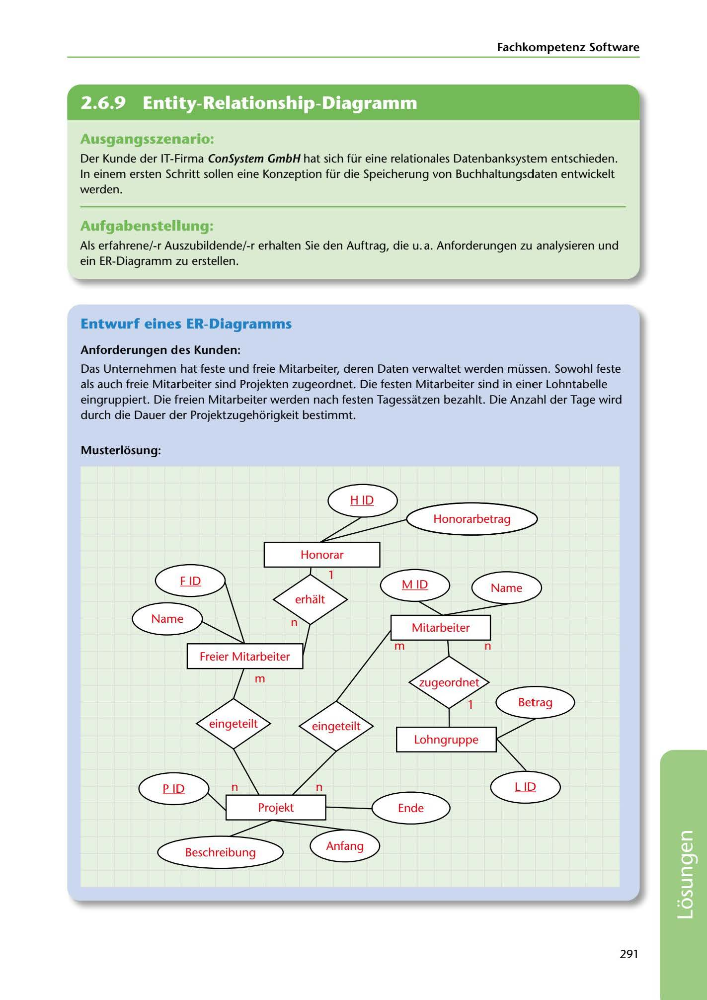

---
## Page 293
---

Fachkompetenz Software

<!-- IMAGE: page-293-img-1.jpeg - TODO: Add description -->

**[VISUAL: ER DIAGRAM - EMPLOYEE AND PROJECT MANAGEMENT SOLUTION]**
A completed Entity-Relationship (ER) diagram for managing employees and projects. Shows entities for fixed employees (feste Mitarbeiter), freelancers (freie Mitarbeiter), projects (Projekt), and salary table (Lohntabelle). Includes relationships, attributes (Name, Honorar, Lohngruppe, P_ID, L_ID, Ende), and cardinality notations showing project assignment relationships.

## Ausgangsszenario:

Der Kunde der IT-Firma ConSystem GmbH hat sich für eine relationales Datenbanksystem entschieden. In einem ersten Schritt sollen eine Konzeption für die Speicherung von Buchhaltungsdaten entwickelt werden.

## Aufgabenstellung:

Als erfahrene/-r Auszubildende/-r erhalten Sie den Auttrag, die u.a. Anforderungen zu analysieren und ein ER-Diagramm zu erstellen.

## Entwurf eines ER-Diagramms

### Anforderungen des Kunden:

Das Unternehmen hat teste und freie Mitarbeiter, deren Daten verwaltet werden müssen. Sowohl teste als auch freie Mitarbeiter sind Projekten zugeordnet. Die testen Mitarbeiter sind in einer Lohntabelle eingruppiert. Die freien Mitarbeiter werden nach testen Tagessatzen bezahlt. Die Anzahl der Tage wird durch die Dauer der Projektzugehorigkeit bestimmt.

### Musterlosung:

Honorarbetrag

Honorar

Name

Betrag

Lohngruppe

P ID L ID

Ende

**[VISUAL: ER DIAGRAM - EMPLOYEE AND PROJECT MANAGEMENT SOLUTION]**
A completed Entity-Relationship (ER) diagram for managing employees and projects. Shows entities for fixed employees (feste Mitarbeiter), freelancers (freie Mitarbeiter), projects (Projekt), and salary table (Lohntabelle). Includes relationships, attributes (Name, Honorar, Lohngruppe, P_ID, L_ID, Ende), and cardinality notations showing project assignment relationships.

291

**[VISUAL: ER DIAGRAM - EMPLOYEE AND PROJECT MANAGEMENT SOLUTION]**
A completed Entity-Relationship (ER) diagram for managing employees and projects. Shows entities for fixed employees (feste Mitarbeiter), freelancers (freie Mitarbeiter), projects (Projekt), and salary table (Lohntabelle). Includes relationships, attributes (Name, Honorar, Lohngruppe, P_ID, L_ID, Ende), and cardinality notations showing project assignment relationships.
