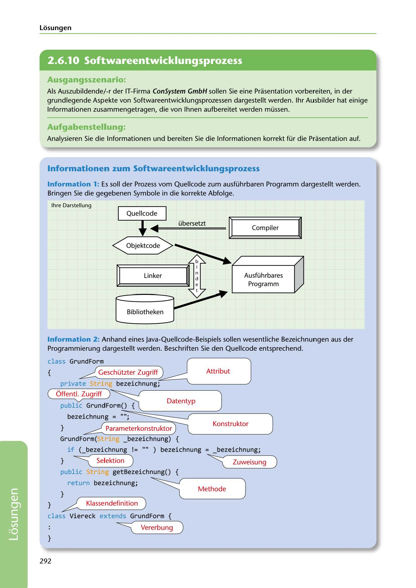

---
## Page 294
---

Losungen

<!-- IMAGE: page-294-img-1.jpeg - TODO: Add description -->

## Ausgangsszenario:

Als Auszubildende/-r der IT-Firma ConSystem GmbH sollen Sie eine Prasentation vorbereiten, in der grundlegende Aspekte von Softwareentwicklungsprozessen dargestellt werden. 1hr Ausbilder hat einige lnformationen zusammengetragen, die von lhnen aufbereitet werden müssen.

## Aufgabenstellung:

Analysieren Sie die lnformationen und bereiten Sie die lnformationen korrekt für die Prasentation auf.

## 1 nformationen zum Softwareentwicklungsprozess

lnformation 1: Es soll der Prozess vom Quellcode zum ausführbaren Programm dargestellt werden. Bringen Sie die gegebenen Symbole in die korrekte Abfolge.

Objektcode

# __ _.__~◄~~==u=

# ~

lhre Darstellung Quellcode ·· b=e=r=se=t=zt=== ll~=====C=o=m=p=il=e=r ====~~ nr:;:1======L=in=k=e=r====::::::¡¡r ~ ,___A_u_s-fu-.. h-r-b-ar_e_s _-<

~ ~ Programm

**[VISUAL: SOFTWARE DEVELOPMENT PROCESS AND JAVA CODE ANATOMY - SOLUTION]**
Two annotated diagrams: (1) Compilation process flow showing: Quellcode (source code) → Compiler → Objektcode (object code) → Linker (with Bibliotheken/libraries) → Ausführbares Programm (executable program). (2) Annotated Java source code example showing labeled programming concepts: class definition (GrundForm), attribute, constructor, parameter constructor, method (getBezeichnung), public access modifier, data types, and inheritance (extends).

Bibliotheken

lnformation 2: Anhand eines Java-Quellcode-Beispiels sollen wesentliche Bezeichnungen aus der Programmierung dargestellt werden. Beschriften Sie den Quellcode entsprechend.

# I

class GrundForm \ (

# ~~

# j

# --------~

{ Attribut private bezeichnung;

**[VISUAL: SOFTWARE DEVELOPMENT PROCESS AND JAVA CODE ANATOMY - SOLUTION]**
Two annotated diagrams: (1) Compilation process flow showing: Quellcode (source code) → Compiler → Objektcode (object code) → Linker (with Bibliotheken/libraries) → Ausführbares Programm (executable program). (2) Annotated Java source code example showing labeled programming concepts: class definition (GrundForm), attribute, constructor, parameter constructor, method (getBezeichnung), public access modifier, data types, and inheritance (extends).

( Óffentl. Zugriff )

## bezeichnung = ,,.;:,;=::2:::=::===----::::====::.------____

°'v' Datentyp public GrundForm()

} Parameterkonstruktor Konstruktor

**[VISUAL: SOFTWARE DEVELOPMENT PROCESS AND JAVA CODE ANATOMY - SOLUTION]**
Two annotated diagrams: (1) Compilation process flow showing: Quellcode (source code) → Compiler → Objektcode (object code) → Linker (with Bibliotheken/libraries) → Ausführbares Programm (executable program). (2) Annotated Java source code example showing labeled programming concepts: class definition (GrundForm), attribute, constructor, parameter constructor, method (getBezeichnung), public access modifier, data types, and inheritance (extends).

## if (_bezeichnung != "" ) bezeichnung = _bezeichnung;

GrundForm( _bezeichnung) {

Methode

**[VISUAL: SOFTWARE DEVELOPMENT PROCESS AND JAVA CODE ANATOMY - SOLUTION]**
Two annotated diagrams: (1) Compilation process flow showing: Quellcode (source code) → Compiler → Objektcode (object code) → Linker (with Bibliotheken/libraries) → Ausführbares Programm (executable program). (2) Annotated Java source code example showing labeled programming concepts: class definition (GrundForm), attribute, constructor, parameter constructor, method (getBezeichnung), public access modifier, data types, and inheritance (extends).

# ~

## getBezeichnung() { --------

} ~ public return bezeichnung; } } / Klassendefinition )

# ~

class Viereck extends GrundForm { }

292

**[VISUAL: SOFTWARE DEVELOPMENT PROCESS AND JAVA CODE ANATOMY - SOLUTION]**
Two annotated diagrams: (1) Compilation process flow showing: Quellcode (source code) → Compiler → Objektcode (object code) → Linker (with Bibliotheken/libraries) → Ausführbares Programm (executable program). (2) Annotated Java source code example showing labeled programming concepts: class definition (GrundForm), attribute, constructor, parameter constructor, method (getBezeichnung), public access modifier, data types, and inheritance (extends).
