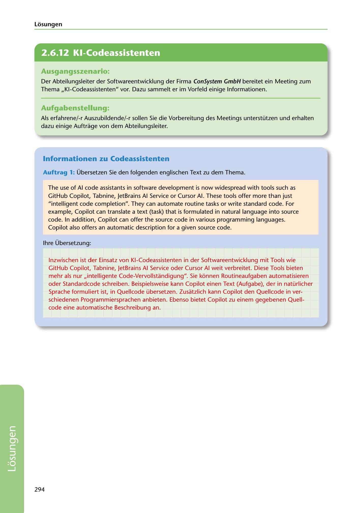

---
## Page 296
---

Losungen

<!-- IMAGE: page-296-img-1.jpeg - TODO: Add description -->

## Ausgangsszenario:

Der Abteilungsleiter der Softwareentwicklung der Firma ConSystem GmbH bereitet ein Meeting zum Thema ,,KI-Codeassistenten" vor. Dazu sammelt er im Vorfeld einige lnformationen.

## Aufgabenstellung:

Als erfahrene/-r Auszubildende/-r sallen Sie die Vorbereitung des Meetings unterstützen und erhalten dazu einige Auftrage van dem Abteilungsleiter.

## lnformationen zu Codeassistenten

Auftrag 1: Übersetzen Sie den folgenden englischen Text zu dem Thema.

The use of Al code assistants in software development is now widespread with tools such as GitHub Copilot, Tabnine, JetBrains Al Service or Cursor Al. These tools offer more than just "intelligent code completion". They can automate routine tasks or write standard code. Far example, Copilot can translate a text (task) that is formulated in natural language into source code. In addition, Copilot can offer the source code in various programming languages. Copilot also offers an automatic description far a given source code.

lhre Übersetzung:

lnzwischen ist der Einsatz van KI-Codeassistenten in der Softwareentwicklung mit Tools wie GitHub Copilot, Tabnine, JetBrains Al Service oder Cursor Al weit verbreitet. Diese Tools bieten mehr als nur ,,intelligente Code-Vervollstandigung". Sie kéinnen Routineaufgaben automatisieren oder Standardcode schreiben. Beispielsweise kann Copilot einen Text (Aufgabe), der in natürlicher Sprache formuliert ist, in Quellcode übersetzen. Zusatzlich kann Copilot den Quellcode in ver- schiedenen Programmiersprachen anbieten. Ebenso bietet Copilot zu einem gegebenen Quell- code eine automatische Beschreibung an.

294

**[VISUAL: CONSYSTEM GMBH SOLUTION HEADER]**
Header image for the ConSystem GmbH AI code assistants solutions section.
