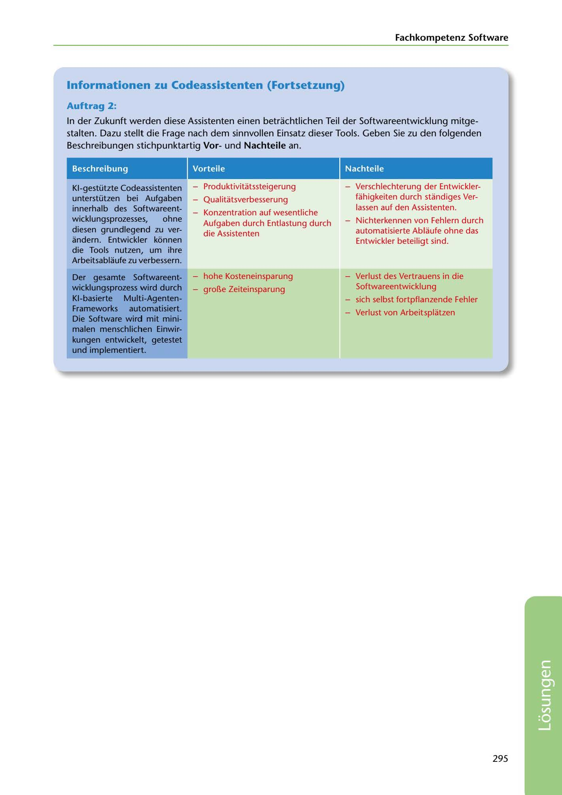

---
## Page 297
---

Fachkompetenz Software

## lnformationen zu Codeassistenten (Fortsetzung)

### Auftrag 2:

### Beschreibungen stichpunktartig Vorund Nachteile an.

In der Zukunft werden diese Assistenten einen betrachtlichen Teil der Softwareentwicklung mitge- stalten. Dazu stellt die Frage nach dem sinnvollen Einsatz dieser Tools. Geben Sie zu den folgenden

Beschreibung

Vorteile

Nachteile

- Produktivitatssteigerung

- Qualitatsverbesserung

Verschlechterung der Entwickler- fahigkeiten durch standiges Ver- lassen auf den Assistenten.

- Konzentration auf wesentliche Aufgaben durch Entlastung durch die Assistenten

Nichterkennen von Fehlern durch automatisierte Ablaufe ohne das Entwickler beteiligt sind.

Kl-gestützte Codeassistenten unterstützen bei Aufgaben innerhalb des Softwareent- wicklungsprozesses, ohne diesen grundlegend zu ver- andern. Entwickler konnen die Tools nutzen, um ihre Arbeitsablaufe zu verbessern.

Verlust des Vertrauens in die Softwareentwicklung

sich selbst fortpflanzende Fehler

Verlust von Arbeitsplatzen

### Der gesamte Softwareent-

### wicklungsprozess wird durch

### Kl-basierte

### Multi-Agenten-

### Frameworks

### automatisiert.

### Die Software wird mit mini-

### malen menschlichen Einwir-

### kungen entwickelt, getestet

### und implementiert.

- hohe Kosteneinsparung - gro~e Zeiteinsparung

295

<!-- IMAGE: page-297-img-1.jpeg - TODO: Add description -->
