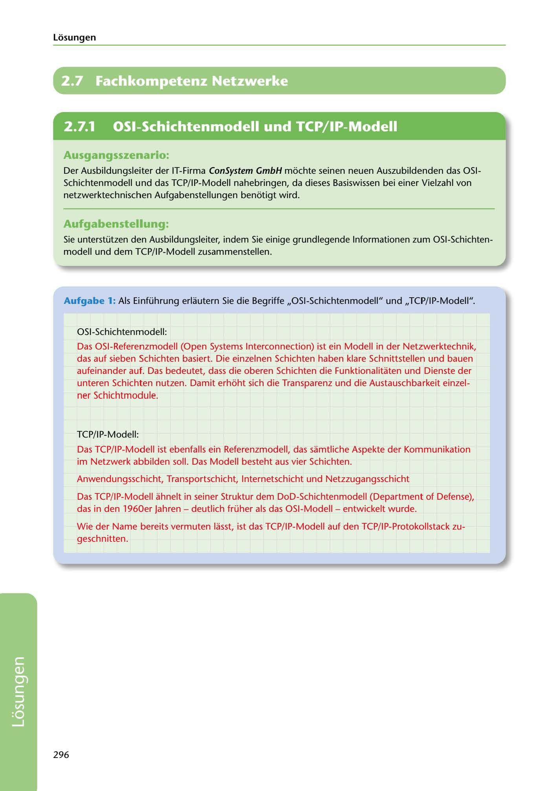

---
## Page 298
---

Losungen

# 2.7 Fachkompetenz Netzwerke

<!-- IMAGE: page-298-img-1.jpeg - TODO: Add description -->

**[VISUAL: CONSYSTEM GMBH SOLUTION HEADER]**
Header image for the ConSystem GmbH OSI and TCP/IP network models solutions section.

## Ausgangsszenario:

Der Ausbildungsleiter der IT-Firma ConSystem GmbH mochte seinen neuen Auszubildenden das OSI- Schichtenmodell und das TCP/ IP-Modell nahebringen, da dieses Basiswissen bei einer Vielzahl von netzwerktechnischen Aufgabenstellungen benotigt wird.

## Aufgabenstellung:

Sie unterstützen den Ausbildungsleiter, indem Sie einige grundlegende lnformationen zum OSI-Schichten- modell und dem TCP/IP-Modell zusammenstellen.

Aufgabe 1: Als Einführung erlautern Sie die Begriffe ,,OSI-Schichtenmodell" und ,,TCP/ IP-Modell".

OSI-Schichtenmodell:

Das OSI-Referenzmodell (Open Systems lnterconnection) ist ein Modell in der Netzwerktechnik, das auf sieben Schichten basiert. Die einzelnen Schichten haben klare Schnittstellen und bauen aufeinander auf. Das bedeutet, dass die oberen Schichten die Funktionalitaten und Dienste der unteren Schichten nutzen. Damit erhoht sich die Transparenz und die Austauschbarkeit einzel- ner Schichtmodule.

TCP/IP-Modell:

Das TCP/IP-Modell ist ebenfalls ein Referenzmodell, das samtliche Aspekte der Kommunikation im Netzwerk abbilden soll. Das Modell besteht aus vier Schichten.

Anwendungsschicht, Transportschicht, lnternetschicht und Netzzugangsschicht

Das TCP/IP-Modell ahnelt in seiner Struktur dem DoD-Schichtenmodell (Department of Defense), das in den 1960er Jahren - deutlich früher als das OSI-Modell - entwickelt wurde.

Wie der Name bereits vermuten lasst, ist das TCP/IP-Modell auf den TCP/IP-Protokollstack zu- geschnitten.

296

**[VISUAL: CONSYSTEM GMBH SOLUTION HEADER]**
Header image for the ConSystem GmbH OSI and TCP/IP network models solutions section.
