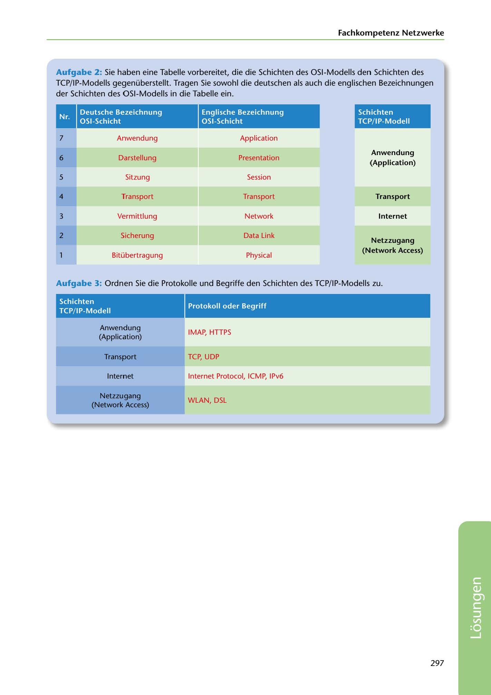

---
## Page 299
---

Fachkompetenz Netzwerke

Aufgabe 2: Sie haben eine Tabelle vorbereitet, die die Schichten des 0S1-Modells den Schichten des TCP/IP-Modells gegenüberstellt. Tragen Sie sowohl die deutschen als auch die englischen Bezeichnungen

der Schichten des 0S1-Modells in die Tabelle ein.

### Deutsche Bezeichnung

### OSI-Schicht

### Englische Bezeichnung

### OSI-Schicht

### Schichten

### TCP/ IP-Modell

7

Anwendung

Application

Darstellung

Presentation

### 6

### Anwendung

### (Application)

Sitzung

Session

### 5

Transport

Transport

### 4

### Transport

Vermittlung

Network

### Internet

3

Sicherung

Data Link

### 2

### Netzzugang

### (Network Access)

Bitübertragung

Physical

Aufgabe 3: Ordnen Sie die Protokolle und Begriffe den Schichten des TCP/ IP-Modells zu.

### Protokoll oder Begriff

### Schichten

### TCP/ IP-Modell

IMAP, HTTPS

### Anwendung

### (Application)

TCP, UDP

### Transport

Internet Protocol, ICMP, 1Pv6

### Internet

WLAN, DSL

### Netzzugang

### (Network Access)

297

<!-- IMAGE: page-299-img-1.jpeg - TODO: Add description -->
